<div align="center">


# 🔒 Hybrid Cipher Program — RSA + AES

**A Java Swing desktop application demonstrating hybrid encryption,**
**combining asymmetric (RSA) and symmetric (AES) cryptography to protect messages.**


### 🌐 Choose Language / Selecione o idioma / Elija el idioma

[](README.md)
[](README_PT.md)
[](README_ES.md)

</div>

---

## 📖 About the Project

The **Hybrid Cipher Program** is a desktop application built in **Java Swing** that demonstrates, in practice, the same cryptographic strategy used by protocols such as **TLS/HTTPS**: encrypting the message with a fast symmetric algorithm (**AES**) and protecting the symmetric key with a slower but more secure asymmetric algorithm (**RSA**).

This repository also documents the project following a full Software Engineering lifecycle — requirements, use cases, UML diagrams, data modeling, architecture, personas and wireframes — for academic and portfolio purposes.

---

## 📚 Table of Contents

- [1. Requirements](#1-requirements-)
- [2. Use Cases](#2-use-cases-)
- [3. Requirements Traceability Matrix](#3-requirements-traceability-matrix-)
- [4. Software Requirements Specification (SRS)](#4-software-requirements-specification-srs-)
- [5. UML & Structural Diagrams](#5-uml--structural-diagrams-)
- [6. Data Model & Data Dictionary](#6-data-model--data-dictionary-)
- [7. Data Flow Diagram (DFD) & Data Lineage](#7-data-flow-diagram-dfd--data-lineage-)
- [8. Architecture Diagram & Flowchart](#8-architecture-diagram--flowchart-)
- [9. Persona & User Journey Map](#9-persona--user-journey-map-)
- [10. Wireframes & Mockups](#10-wireframes--mockups-)
- [Installation & Execution](#-installation--execution)
- [Author](#-author)

---

## 1. Requirements 📋

<details>
<summary><strong>Click to expand — Functional, Non-Functional, Business, Domain, Data & Interface Requirements</strong></summary>

### 1.1 Functional Requirements (FR)

| ID | Requirement |
|:---|:---|
| FR01 | The system **must generate** an RSA key pair (public/private) on demand. |
| FR02 | The system **must display** the generated public and private keys on screen. |
| FR03 | The system **must allow** the user to type a plaintext message. |
| FR04 | The system **must encrypt** the message using a hybrid scheme: AES for the message, RSA for the AES key. |
| FR05 | The system **must display** the AES‑encrypted message and the RSA‑encrypted session key. |
| FR06 | The system **must decrypt** an encrypted payload using the RSA private key, recovering the AES key and then the original message. |
| FR07 | The system **must allow** clearing all text fields with a single action. |
| FR08 | The system **must allow** the user to close the application. |
| FR09 | The system **must inform** the user when an operation cannot be completed (e.g., decrypting without a valid key). |

### 1.2 Non-Functional Requirements (NFR)

| ID | Requirement |
|:---|:---|
| NFR01 | RSA keys **must be at least 2048 bits**. |
| NFR02 | AES session keys **must use 256-bit keys**. |
| NFR03 | The application **must run** on any OS with Java 8+ installed (portability). |
| NFR04 | The GUI **must respond** to user actions in under 1 second for typical message sizes. |
| NFR05 | The application **must not persist** keys or messages to disk (confidentiality by design). |
| NFR06 | The interface **must be simple enough** for a user with no cryptography background to operate it. |
| NFR07 | The codebase **must rely only** on the standard Java Cryptography Architecture (JCA), no external crypto libraries. |

### 1.3 Business Rules (BR)

| ID | Rule |
|:---|:---|
| BR01 | A message **cannot be encrypted** before an RSA key pair has been generated. |
| BR02 | Every encryption operation **must generate a brand-new random AES session key** — keys are never reused. |
| BR03 | Decryption **requires both** the encrypted payload (AES ciphertext + encrypted AES key) **and** the matching RSA private key. |
| BR04 | The "Clear" action **resets the UI state** without leaving residual data in memory-visible fields. |
| BR05 | The public key may be freely shared; the private key **must never** leave the local application. |

### 1.4 Domain Requirements

| ID | Requirement |
|:---|:---|
| DR01 | The system operates within the **Cryptography** domain and must correctly implement the **Hybrid Encryption** pattern (asymmetric key‑wrapping + symmetric payload encryption). |
| DR02 | RSA operations must follow standard **JCA** key generation and cipher transformations (`RSA/ECB/PKCS1Padding` or equivalent). |
| DR03 | AES operations must use a valid **block cipher mode** (e.g., `AES/ECB/PKCS5Padding` or `AES/CBC/PKCS5Padding`) consistent between encryption and decryption. |

### 1.5 Data Requirements

| ID | Requirement |
|:---|:---|
| DAR01 | Keys are represented internally as `PublicKey` / `PrivateKey` (`java.security`) and displayed as **Base64-encoded strings**. |
| DAR02 | Messages are handled as **UTF-8 encoded strings**. |
| DAR03 | Encrypted output (ciphertext + encrypted session key) is represented as **byte arrays** and displayed as Base64. |
| DAR04 | No data is written to permanent storage in the current version — all data is **in-memory / session-scoped**. |

### 1.6 Interface Requirements

| ID | Requirement |
|:---|:---|
| IR01 | A single-window **Swing GUI** with input/output `JTextArea` components and action `JButton`s. |
| IR02 | Buttons: **Generate Keys**, **Encrypt**, **Decrypt**, **Clear**, **Exit**. |
| IR03 | Output fields are **read-only** and selectable for copy/paste. |
| IR04 | The layout must remain usable when resized (responsive Swing layout managers). |

</details>

---

## 2. Use Cases 🧩

<details>
<summary><strong>Click to expand — Use Case Specifications</strong></summary>

### Use Case Diagram

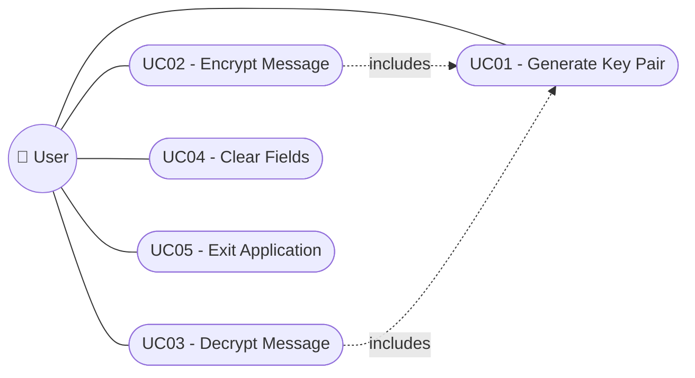
```mermaid
flowchart LR
    User((🧑 User))

    UC1([UC01 - Generate Key Pair])
    UC2([UC02 - Encrypt Message])
    UC3([UC03 - Decrypt Message])
    UC4([UC04 - Clear Fields])
    UC5([UC05 - Exit Application])

    User --- UC1
    User --- UC2
    User --- UC3
    User --- UC4
    User --- UC5

    UC2 -. includes .-> UC1
    UC3 -. includes .-> UC1
```

### UC01 — Generate Key Pair
| Field | Description |
|:---|:---|
| **Actor** | User |
| **Precondition** | Application is open. |
| **Main Flow** | 1. User clicks **"Generate Keys"**. 2. System generates an RSA-2048 key pair. 3. System displays public and private keys in Base64. |
| **Postcondition** | A valid key pair is available for encryption/decryption. |

### UC02 — Encrypt Message
| Field | Description |
|:---|:---|
| **Actor** | User |
| **Precondition** | A key pair has been generated (BR01). |
| **Main Flow** | 1. User types a message. 2. User clicks **"Encrypt"**. 3. System generates a random AES-256 key. 4. System encrypts the message with AES. 5. System encrypts the AES key with the RSA public key. 6. System displays both encrypted outputs. |
| **Alternative Flow** | If no key pair exists, system shows an error (FR09). |
| **Postcondition** | Encrypted message and encrypted session key are displayed. |

### UC03 — Decrypt Message
| Field | Description |
|:---|:---|
| **Actor** | User |
| **Precondition** | An encrypted payload and the RSA private key are available (BR03). |
| **Main Flow** | 1. User clicks **"Decrypt"**. 2. System decrypts the AES key using the RSA private key. 3. System decrypts the message using the recovered AES key. 4. System displays the original plaintext. |
| **Alternative Flow** | If decryption fails (wrong key/data), system shows an error (FR09). |
| **Postcondition** | Original message is displayed. |

### UC04 — Clear Fields
| Field | Description |
|:---|:---|
| **Actor** | User |
| **Main Flow** | 1. User clicks **"Clear"**. 2. System resets all text areas to empty. |
| **Postcondition** | UI returns to its initial state (BR04). |

### UC05 — Exit Application
| Field | Description |
|:---|:---|
| **Actor** | User |
| **Main Flow** | 1. User clicks **"Exit"**. 2. System closes the application window. |

</details>

---

## 3. Requirements Traceability Matrix 🔗

<details>
<summary><strong>Click to expand — Traceability Matrix</strong></summary>

| Requirement | Use Case | Diagram(s) | Verification |
|:---|:---|:---|:---|
| FR01, FR02 | UC01 | Sequence, State Machine, Class | Manual test: click "Generate Keys", verify keys displayed |
| FR03, FR04, FR05 | UC02 | Sequence, Activity, Class, Use Case | Manual test: encrypt sample message, verify ciphertext + encrypted key shown |
| FR06 | UC03 | Sequence, Activity, State Machine | Manual test: decrypt previous output, verify original message recovered |
| FR07 | UC04 | State Machine | Manual test: click "Clear", verify all fields empty |
| FR08 | UC05 | Use Case, Deployment | Manual test: click "Exit", verify app closes |
| FR09 | UC02, UC03 | Activity | Manual test: decrypt with invalid data, verify error message |
| NFR01, NFR02 | UC01, UC02 | Class, Data Dictionary | Code review of key sizes (RSA 2048 / AES 256) |
| NFR05 | UC02, UC03 | DFD, Data Lineage | Confirm no file/DB writes occur |
| BR01–BR05 | UC01–UC04 | State Machine, Activity | Manual test of business rule enforcement |

</details>

---

## 4. Software Requirements Specification (SRS) 📄

<details>
<summary><strong>Click to expand — SRS Summary (IEEE 830-style)</strong></summary>

### 4.1 Introduction
- **Purpose:** Specify the requirements for the Hybrid Cipher Program, a desktop tool for educational demonstration of RSA + AES hybrid encryption.
- **Scope:** Single-user, offline, Java Swing desktop application. No network or persistence layer in the current version.
- **Definitions:** *RSA* — Rivest-Shamir-Adleman asymmetric algorithm. *AES* — Advanced Encryption Standard symmetric algorithm. *JCA* — Java Cryptography Architecture. *Session Key* — randomly generated AES key used once per message.

### 4.2 Overall Description
- **Product Perspective:** Standalone JAR application, built with Apache NetBeans/Ant.
- **Product Functions:** Key generation, hybrid encryption, hybrid decryption, field clearing, application exit (see Section 1.1).
- **User Characteristics:** Students/developers studying applied cryptography; no prior security expertise required.
- **Constraints:** Must use only `java.security` / `javax.crypto` (JCA/JCE) APIs; must run on Java 8+.
- **Assumptions:** The user trusts their local machine; private keys are not protected by a passphrase in this version.

### 4.3 Specific Requirements
- See [Section 1 — Requirements](#1-requirements-) for the complete FR / NFR / BR / Domain / Data / Interface breakdown.
- See [Section 2 — Use Cases](#2-use-cases-) for behavioral specifications.

### 4.4 Appendices
- See [Section 5 — UML & Structural Diagrams](#5-uml--structural-diagrams-) and [Section 6 — Data Model & Data Dictionary](#6-data-model--data-dictionary-).

</details>

---

## 5. UML & Structural Diagrams 🏗️

<details>
<summary><strong>5.1 Use Case Diagram</strong></summary>

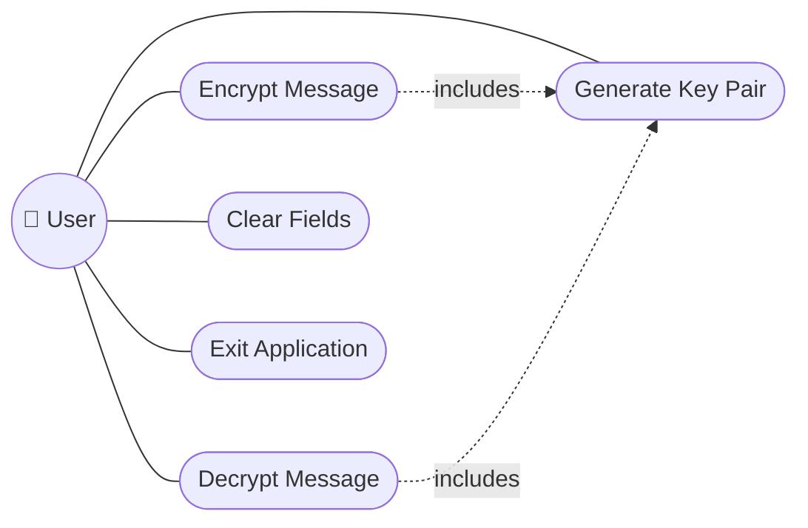
```mermaid
flowchart LR
    User((🧑 User))
    UC1([Generate Key Pair])
    UC2([Encrypt Message])
    UC3([Decrypt Message])
    UC4([Clear Fields])
    UC5([Exit Application])

    User --- UC1
    User --- UC2
    User --- UC3
    User --- UC4
    User --- UC5
    UC2 -. includes .-> UC1
    UC3 -. includes .-> UC1
```
</details>

<details>
<summary><strong>5.2 Class Diagram</strong></summary>

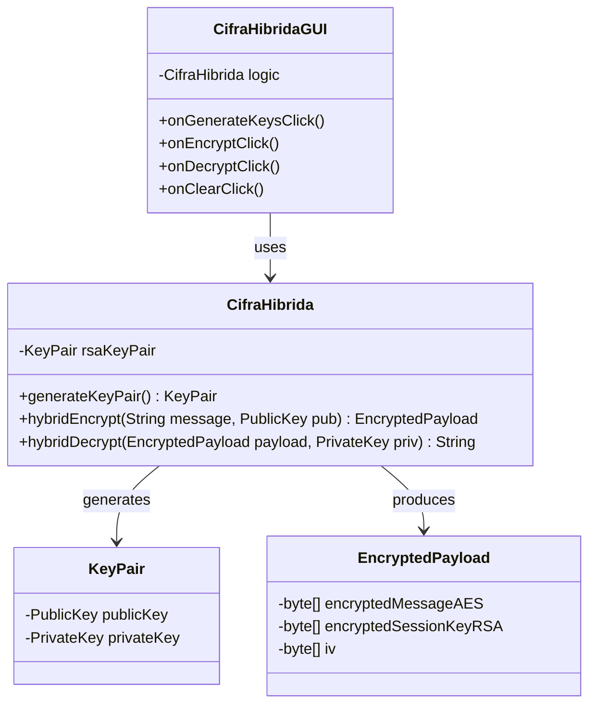
```mermaid
classDiagram
    class CifraHibridaGUI {
        -CifraHibrida logic
        +onGenerateKeysClick()
        +onEncryptClick()
        +onDecryptClick()
        +onClearClick()
    }
    class CifraHibrida {
        -KeyPair rsaKeyPair
        +generateKeyPair() KeyPair
        +hybridEncrypt(String message, PublicKey pub) EncryptedPayload
        +hybridDecrypt(EncryptedPayload payload, PrivateKey priv) String
    }
    class EncryptedPayload {
        -byte[] encryptedMessageAES
        -byte[] encryptedSessionKeyRSA
        -byte[] iv
    }
    class KeyPair {
        -PublicKey publicKey
        -PrivateKey privateKey
    }
    CifraHibridaGUI --> CifraHibrida : uses
    CifraHibrida --> KeyPair : generates
    CifraHibrida --> EncryptedPayload : produces
```
</details>

<details>
<summary><strong>5.3 Object Diagram</strong></summary>

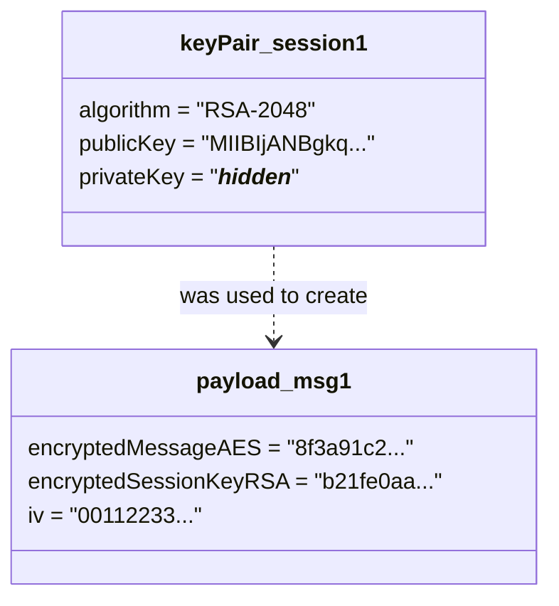
```mermaid
classDiagram
    class keyPair_session1 {
        algorithm = "RSA-2048"
        publicKey = "MIIBIjANBgkq..."
        privateKey = "***hidden***"
    }
    class payload_msg1 {
        encryptedMessageAES = "8f3a91c2..."
        encryptedSessionKeyRSA = "b21fe0aa..."
        iv = "00112233..."
    }
    keyPair_session1 ..> payload_msg1 : was used to create
```
*Instance snapshot of a single encryption operation at runtime.*
</details>

<details>
<summary><strong>5.4 Sequence Diagram</strong></summary>

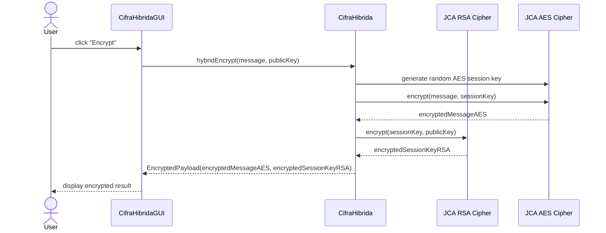
```mermaid
sequenceDiagram
    actor U as User
    participant GUI as CifraHibridaGUI
    participant LOG as CifraHibrida
    participant RSA as JCA RSA Cipher
    participant AES as JCA AES Cipher

    U->>GUI: click "Encrypt"
    GUI->>LOG: hybridEncrypt(message, publicKey)
    LOG->>AES: generate random AES session key
    LOG->>AES: encrypt(message, sessionKey)
    AES-->>LOG: encryptedMessageAES
    LOG->>RSA: encrypt(sessionKey, publicKey)
    RSA-->>LOG: encryptedSessionKeyRSA
    LOG-->>GUI: EncryptedPayload(encryptedMessageAES, encryptedSessionKeyRSA)
    GUI-->>U: display encrypted result
```
</details>

<details>
<summary><strong>5.5 Communication (Collaboration) Diagram</strong></summary>

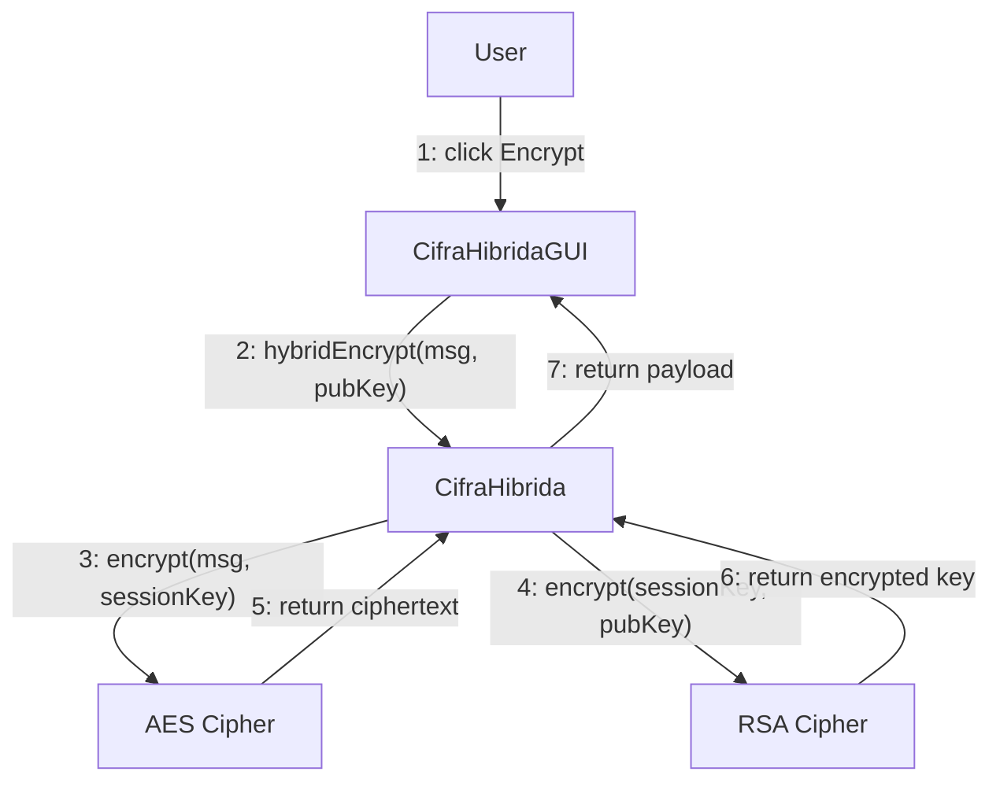
```mermaid
flowchart TD
    U[User]
    GUI[CifraHibridaGUI]
    LOG[CifraHibrida]
    AES[AES Cipher]
    RSA[RSA Cipher]

    U -- "1: click Encrypt" --> GUI
    GUI -- "2: hybridEncrypt(msg, pubKey)" --> LOG
    LOG -- "3: encrypt(msg, sessionKey)" --> AES
    LOG -- "4: encrypt(sessionKey, pubKey)" --> RSA
    AES -- "5: return ciphertext" --> LOG
    RSA -- "6: return encrypted key" --> LOG
    LOG -- "7: return payload" --> GUI
```
</details>

<details>
<summary><strong>5.6 Activity Diagram</strong></summary>

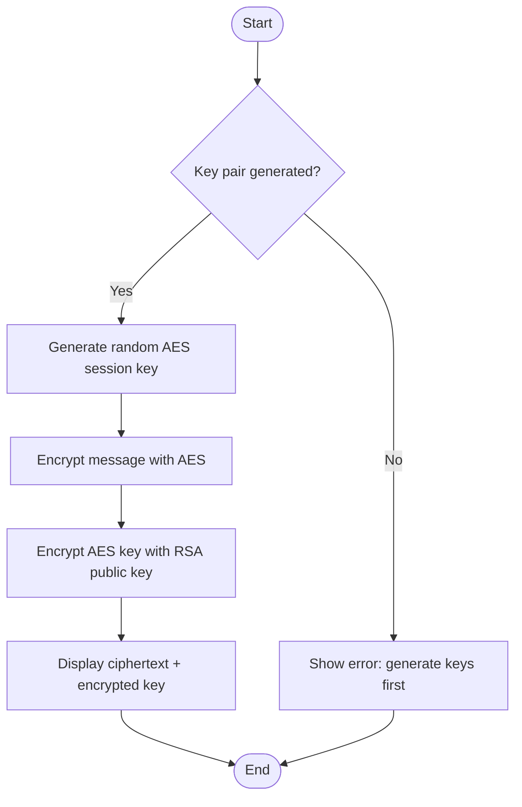
```mermaid
flowchart TD
    Start([Start]) --> A{Key pair generated?}
    A -- No --> Err1[Show error: generate keys first]
    A -- Yes --> B[Generate random AES session key]
    B --> C[Encrypt message with AES]
    C --> D[Encrypt AES key with RSA public key]
    D --> E[Display ciphertext + encrypted key]
    E --> End([End])
    Err1 --> End
```
</details>

<details>
<summary><strong>5.7 State Machine Diagram</strong></summary>

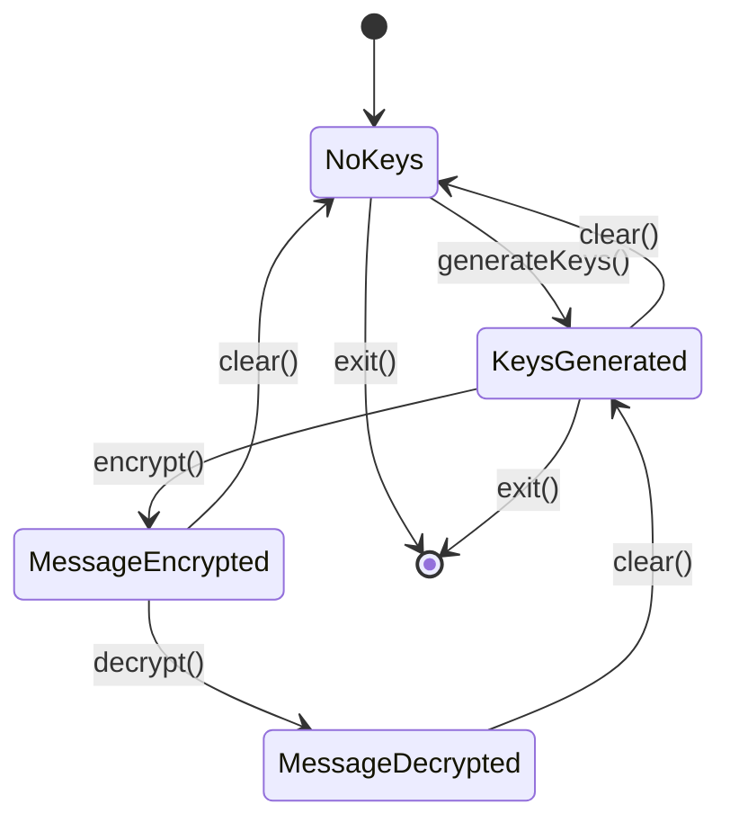
```mermaid
stateDiagram-v2
    [*] --> NoKeys
    NoKeys --> KeysGenerated : generateKeys()
    KeysGenerated --> MessageEncrypted : encrypt()
    MessageEncrypted --> MessageDecrypted : decrypt()
    MessageDecrypted --> KeysGenerated : clear()
    KeysGenerated --> NoKeys : clear()
    MessageEncrypted --> NoKeys : clear()
    NoKeys --> [*] : exit()
    KeysGenerated --> [*] : exit()
```
</details>

<details>
<summary><strong>5.8 Component Diagram</strong></summary>

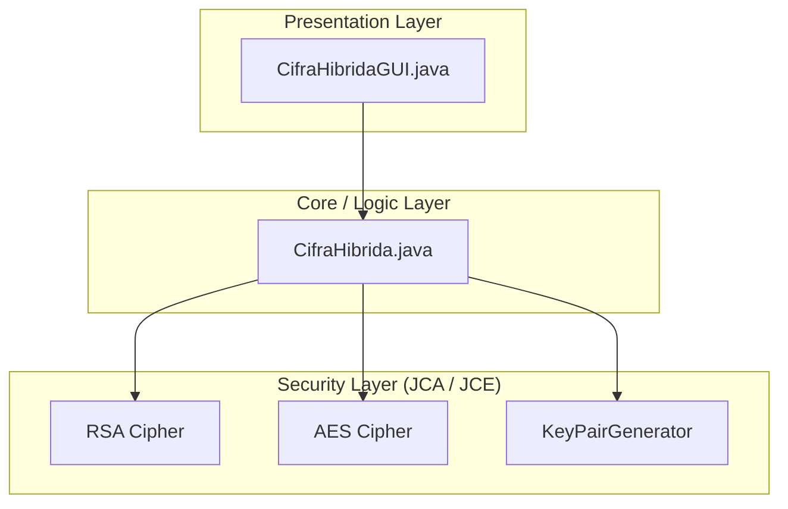
```mermaid
flowchart TB
    subgraph Presentation["Presentation Layer"]
        GUI[CifraHibridaGUI.java]
    end
    subgraph Core["Core / Logic Layer"]
        LOG[CifraHibrida.java]
    end
    subgraph Security["Security Layer (JCA / JCE)"]
        RSA[RSA Cipher]
        AES[AES Cipher]
        KG[KeyPairGenerator]
    end

    GUI --> LOG
    LOG --> RSA
    LOG --> AES
    LOG --> KG
```
</details>

<details>
<summary><strong>5.9 Deployment Diagram</strong></summary>

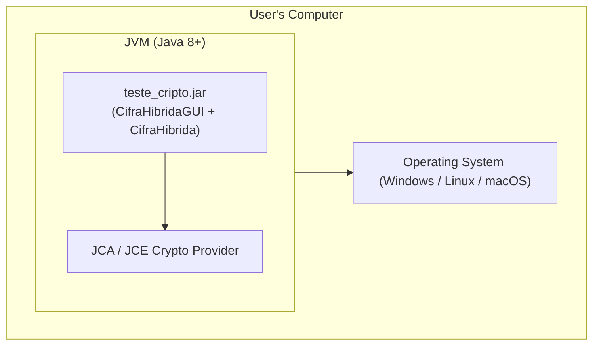
```mermaid
flowchart TB
    subgraph UserMachine["User's Computer"]
        subgraph JVM["JVM (Java 8+)"]
            JAR["teste_cripto.jar\n(CifraHibridaGUI + CifraHibrida)"]
            JCA["JCA / JCE Crypto Provider"]
        end
        OS["Operating System (Windows / Linux / macOS)"]
    end

    JAR --> JCA
    JVM --> OS
```
</details>

<details>
<summary><strong>5.10 Package Diagram</strong></summary>

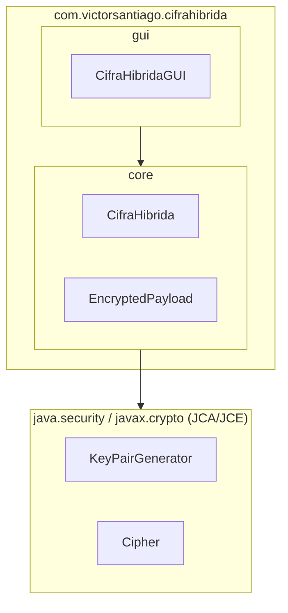
```mermaid
flowchart TB
    subgraph app["com.victorsantiago.cifrahibrida"]
        subgraph gui["gui"]
            G1[CifraHibridaGUI]
        end
        subgraph core["core"]
            C1[CifraHibrida]
            C2[EncryptedPayload]
        end
    end
    subgraph jca["java.security / javax.crypto (JCA/JCE)"]
        K1[KeyPairGenerator]
        K2[Cipher]
    end

    gui --> core
    core --> jca
```
</details>

<details>
<summary><strong>5.11 Composite Structure Diagram</strong></summary>

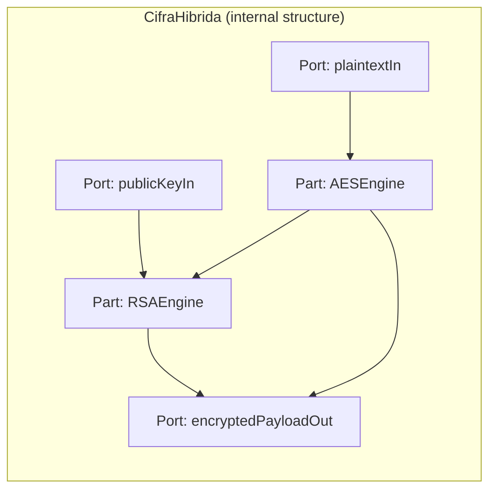
```mermaid
flowchart TB
    subgraph CifraHibrida["CifraHibrida (internal structure)"]
        direction TB
        P1["Port: plaintextIn"]
        P2["Port: publicKeyIn"]
        P3["Part: AESEngine"]
        P4["Part: RSAEngine"]
        P5["Port: encryptedPayloadOut"]

        P1 --> P3
        P2 --> P4
        P3 --> P4
        P4 --> P5
        P3 --> P5
    end
```
</details>

<details>
<summary><strong>5.12 Interaction Overview Diagram</strong></summary>

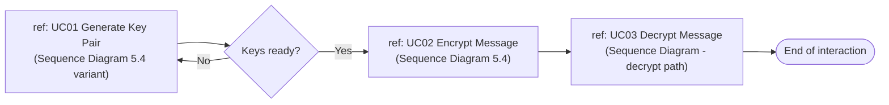
```mermaid
flowchart LR
    A["ref: UC01 Generate Key Pair\n(Sequence Diagram 5.4 variant)"] --> B{Keys ready?}
    B -- Yes --> C["ref: UC02 Encrypt Message\n(Sequence Diagram 5.4)"]
    B -- No --> A
    C --> D["ref: UC03 Decrypt Message\n(Sequence Diagram - decrypt path)"]
    D --> E([End of interaction])
```
</details>

<details>
<summary><strong>5.13 Timing Diagram</strong></summary>

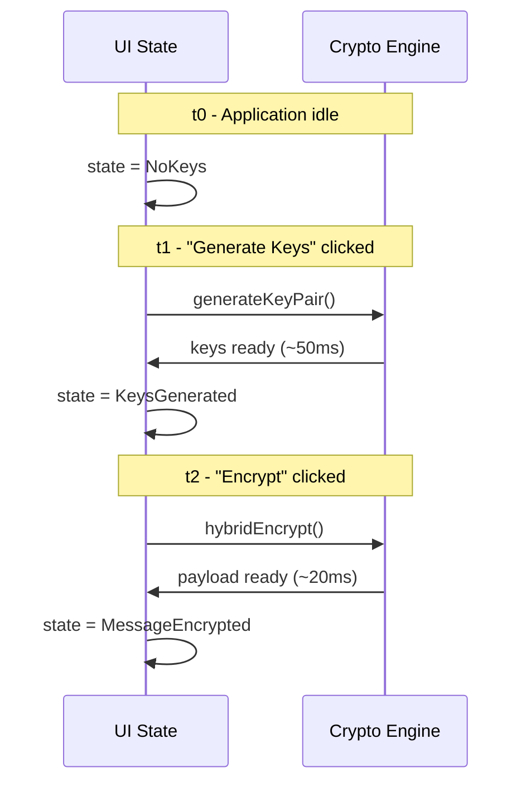
```mermaid
sequenceDiagram
    participant UI as UI State
    participant CR as Crypto Engine

    Note over UI,CR: t0 - Application idle
    UI->>UI: state = NoKeys
    Note over UI,CR: t1 - "Generate Keys" clicked
    UI->>CR: generateKeyPair()
    CR->>UI: keys ready (~50ms)
    UI->>UI: state = KeysGenerated
    Note over UI,CR: t2 - "Encrypt" clicked
    UI->>CR: hybridEncrypt()
    CR->>UI: payload ready (~20ms)
    UI->>UI: state = MessageEncrypted
```
</details>

---

## 6. Data Model & Data Dictionary 🗄️

<details>
<summary><strong>Click to expand — ERD, Conceptual/Logical/Physical Models & Data Dictionary</strong></summary>

### 6.1 Entity-Relationship Diagram (ERD)

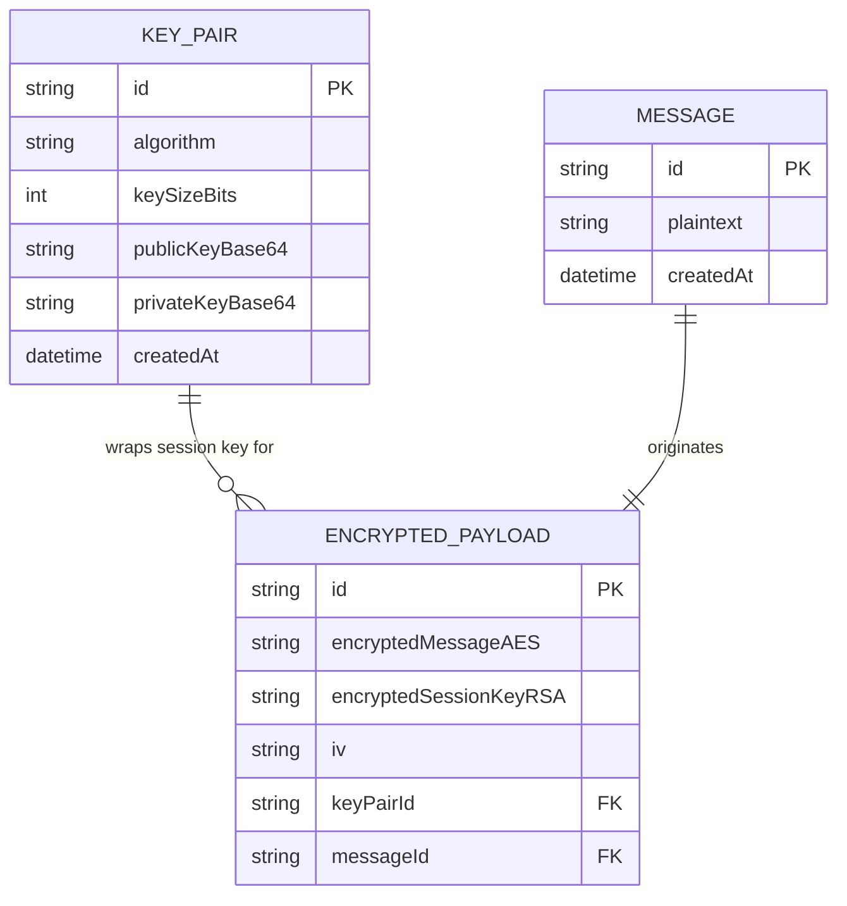
```mermaid
erDiagram
    KEY_PAIR {
        string id PK
        string algorithm
        int keySizeBits
        string publicKeyBase64
        string privateKeyBase64
        datetime createdAt
    }
    MESSAGE {
        string id PK
        string plaintext
        datetime createdAt
    }
    ENCRYPTED_PAYLOAD {
        string id PK
        string encryptedMessageAES
        string encryptedSessionKeyRSA
        string iv
        string keyPairId FK
        string messageId FK
    }

    KEY_PAIR ||--o{ ENCRYPTED_PAYLOAD : "wraps session key for"
    MESSAGE  ||--|| ENCRYPTED_PAYLOAD : "originates"
```

### 6.2 Conceptual Data Model
A simplified, technology-agnostic view: a **User** generates a **Key Pair**, writes a **Message**, and produces an **Encrypted Payload** that bundles the AES ciphertext with the RSA-wrapped AES key.

### 6.3 Logical Data Model
| Entity | Attribute | Type | Notes |
|:---|:---|:---|:---|
| KeyPair | id | UUID | Generated per session |
| KeyPair | algorithm | String | "RSA" |
| KeyPair | keySizeBits | Integer | 2048 (NFR01) |
| KeyPair | publicKeyBase64 | String | Displayed to user |
| KeyPair | privateKeyBase64 | String | Displayed to user (local only) |
| Message | plaintext | String (UTF-8) | User input |
| EncryptedPayload | encryptedMessageAES | byte[] / Base64 | AES-256 ciphertext |
| EncryptedPayload | encryptedSessionKeyRSA | byte[] / Base64 | RSA-wrapped AES key |
| EncryptedPayload | iv | byte[] / Base64 | Initialization vector (if CBC mode) |

### 6.4 Physical Data Model
The current version is **in-memory only** (NFR05/DAR04) — no tables are persisted. If persistence were added, the model above maps directly to relational tables (`key_pair`, `message`, `encrypted_payload`) with `VARCHAR`/`BLOB` columns matching the Logical Data Model.

### 6.5 Data Dictionary

| Field | Type | Description | Constraints |
|:---|:---|:---|:---|
| `publicKey` | `java.security.PublicKey` | RSA public key, shareable | Algorithm = RSA, size = 2048 bits |
| `privateKey` | `java.security.PrivateKey` | RSA private key, secret | Never transmitted (BR05) |
| `sessionKey` | `javax.crypto.SecretKey` | AES key, generated per message | Algorithm = AES, size = 256 bits, single-use (BR02) |
| `plaintext` | `String` | Original user message | UTF-8 encoded |
| `encryptedMessageAES` | `byte[]` | Ciphertext of `plaintext` | AES cipher output |
| `encryptedSessionKeyRSA` | `byte[]` | `sessionKey` encrypted with `publicKey` | RSA cipher output |

</details>

---

## 7. Data Flow Diagram (DFD) & Data Lineage 🔄

<details>
<summary><strong>Click to expand — DFD Level 0/1 and Data Lineage</strong></summary>

### 7.1 Data Flow Diagram (Level 0/1)

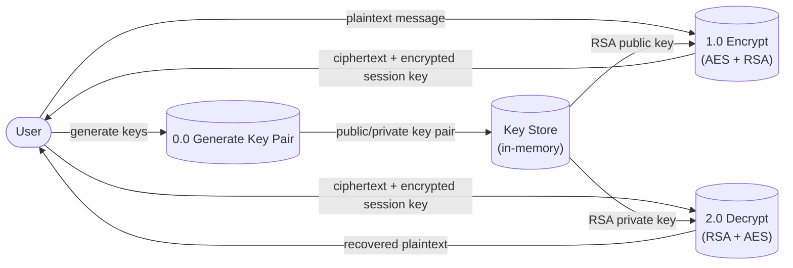
```mermaid
flowchart LR
    U([User]) -->|plaintext message| P1[("1.0 Encrypt\n(AES + RSA)")]
    KS[("Key Store\n(in-memory)")] -->|RSA public key| P1
    P1 -->|ciphertext + encrypted session key| U

    U -->|ciphertext + encrypted session key| P2[("2.0 Decrypt\n(RSA + AES)")]
    KS -->|RSA private key| P2
    P2 -->|recovered plaintext| U

    U -->|"generate keys"| P0[("0.0 Generate Key Pair")]
    P0 -->|public/private key pair| KS
```

### 7.2 Data Lineage Diagram

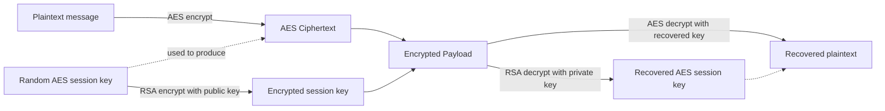
```mermaid
flowchart LR
    A[Plaintext message] -->|AES encrypt| B[AES Ciphertext]
    C[Random AES session key] -->|RSA encrypt with public key| D[Encrypted session key]
    C -.->|used to produce| B
    B --> E[Encrypted Payload]
    D --> E
    E -->|RSA decrypt with private key| C2[Recovered AES session key]
    E -->|AES decrypt with recovered key| A2[Recovered plaintext]
    C2 -.-> A2
```

</details>

---

## 8. Architecture Diagram & Flowchart 🏛️

<details>
<summary><strong>Click to expand — Architecture Overview & Main Flowchart</strong></summary>

### 8.1 Architecture Diagram

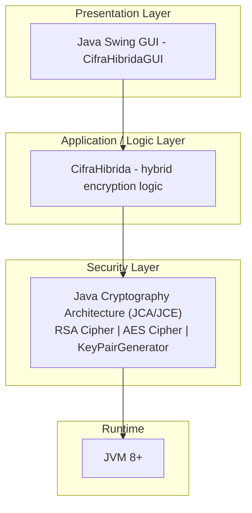
```mermaid
flowchart TB
    subgraph L1["Presentation Layer"]
        UI[Java Swing GUI - CifraHibridaGUI]
    end
    subgraph L2["Application / Logic Layer"]
        LOGIC[CifraHibrida - hybrid encryption logic]
    end
    subgraph L3["Security Layer"]
        JCA["Java Cryptography Architecture (JCA/JCE)\nRSA Cipher | AES Cipher | KeyPairGenerator"]
    end
    subgraph L4["Runtime"]
        JVM["JVM 8+"]
    end

    UI --> LOGIC --> JCA --> JVM
```

### 8.2 Main Flowchart (Encrypt / Decrypt Cycle)

```mermaid
flowchart TD
    Start([Open Application]) --> Gen[Click "Generate Keys"]
    Gen --> Type[Type message]
    Type --> Enc[Click "Encrypt"]
    Enc --> Out1[View AES ciphertext + RSA-encrypted key]
    Out1 --> Share{Share with recipient?}
    Share -- Yes --> Dec[Click "Decrypt" with private key]
    Share -- No --> Clear[Click "Clear"]
    Dec --> Out2[View recovered original message]
    Out2 --> Clear
    Clear --> Decide{Continue?}
    Decide -- Yes --> Type
    Decide -- No --> Exit([Click "Exit"])
```

</details>

---

## 9. Persona & User Journey Map 👤

<details>
<summary><strong>Click to expand — Persona and User Journey Map</strong></summary>

### 9.1 Persona

| | |
|:---|:---|
| **Name** | Ana Souza |
| **Role** | Computer Science student / junior backend developer |
| **Goal** | Understand, hands-on, how hybrid encryption (RSA + AES) works before applying it in a real project. |
| **Tech Level** | Comfortable with Java, new to applied cryptography (JCA/JCE). |
| **Frustrations** | Cryptography theory feels abstract; wants a visual, click-by-click tool to see keys and ciphertext. |
| **Motivation** | Needs to pass a Security course assignment and build a portfolio project. |

### 9.2 User Journey Map

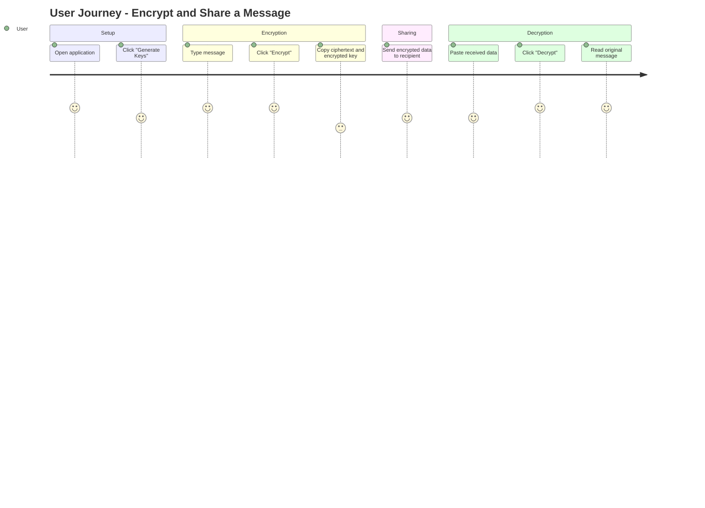
```mermaid
journey
    title User Journey - Encrypt and Share a Message
    section Setup
      Open application: 5: User
      Click "Generate Keys": 4: User
    section Encryption
      Type message: 5: User
      Click "Encrypt": 5: User
      Copy ciphertext and encrypted key: 3: User
    section Sharing
      Send encrypted data to recipient: 4: User
    section Decryption
      Paste received data: 4: User
      Click "Decrypt": 5: User
      Read original message: 5: User
```

</details>

---

## 10. Wireframes & Mockups 🖼️

<details>
<summary><strong>Click to expand — GUI Wireframe</strong></summary>

```
┌──────────────────────────────────────────────────────────────┐
│  🔒 Hybrid Cipher Program — RSA + AES                          │
├──────────────────────────────────────────────────────────────┤
│  Public Key:   [ readonly text area, Base64                ]  │
│  Private Key:  [ readonly text area, Base64                ]  │
│                                       [ 🗝️ Generate Keys ]     │
├──────────────────────────────────────────────────────────────┤
│  Message:      [ multiline input text area                 ]  │
│                                       [ 🔒 Encrypt ]           │
│  Encrypted (AES):     [ readonly text area, Base64         ]  │
│  Encrypted Key (RSA): [ readonly text area, Base64         ]  │
├──────────────────────────────────────────────────────────────┤
│                                       [ 🔓 Decrypt ]           │
│  Decrypted Message:   [ readonly text area                 ]  │
├──────────────────────────────────────────────────────────────┤
│              [ 🧹 Clear ]                  [ 🚪 Exit ]         │
└──────────────────────────────────────────────────────────────┘
```

*Mockup reflects the actual `CifraHibridaGUI` Swing layout: text areas for keys, message and results, plus action buttons (Generate Keys, Encrypt, Decrypt, Clear, Exit).*

</details>

---

## 🚀 Installation & Execution

### Prerequisites
- **Java JDK 8+**
- **Apache NetBeans** *(optional, only needed to build via IDE)*
- **Git**

### Option 1 — Run the pre-built JAR (recommended)

```bash
git clone https://github.com/VictorHJesusSantiago/programa_criptografico_chaves.git
cd programa_criptografico_chaves/teste_cripto/dist
java -jar teste_cripto.jar
```

### Option 2 — Build & run via NetBeans

```
1. Open Apache NetBeans IDE
2. File → Open Project...
3. Select the 'teste_cripto' folder
4. Click "Run Project" (F6)
```

### How to Use

| Step | Action |
|:-:|:---|
| 1️⃣ | Click **Generate Keys** to create the RSA key pair. |
| 2️⃣ | Type the message you want to protect. |
| 3️⃣ | Click **Encrypt** — the AES ciphertext and the RSA-encrypted session key are displayed. |
| 4️⃣ | Click **Decrypt** to recover the original message using the private key. |
| 5️⃣ | Use **Clear** to reset all fields, or **Exit** to close the application. |

---

## 👨‍💻 Author

<div align="center">

**Victor Henrique de Jesus Santiago**
Full Stack Developer

[](mailto:victorhenriquedejesussantiago@gmail.com)
[](https://www.linkedin.com/in/victor-henrique-de-jesus-santiago/)
[](https://github.com/VictorHJesusSantiago)

</div>

---

<div align="center">

*Made with 🔒 and Java by **Victor H. J. Santiago***

</div>
