<div align="center">


# 🔒 Programa de Cifrado Híbrido — RSA + AES

**Una aplicación de escritorio en Java Swing que demuestra el cifrado híbrido,**
**combinando criptografía asimétrica (RSA) y simétrica (AES) para proteger mensajes.**


### 🌐 Choose Language / Selecione o idioma / Elija el idioma

[](README.md)
[](README_PT.md)
[](README_ES.md)

</div>

---

## 📖 Sobre el Proyecto

El **Programa de Cifrado Híbrido** es una aplicación de escritorio construida en **Java Swing** que demuestra, en la práctica, la misma estrategia criptográfica utilizada en protocolos como **TLS/HTTPS**: cifrar el mensaje con un algoritmo simétrico rápido (**AES**) y proteger la clave simétrica con un algoritmo asimétrico más seguro (**RSA**).

Este repositorio también documenta el proyecto siguiendo un ciclo completo de Ingeniería de Software — requisitos, casos de uso, diagramas UML, modelado de datos, arquitectura, personas y wireframes — con fines académicos y de portafolio.

---

## 📚 Tabla de Contenidos

- [1. Requisitos](#1-requisitos-)
- [2. Casos de Uso](#2-casos-de-uso-)
- [3. Matriz de Trazabilidad de Requisitos](#3-matriz-de-trazabilidad-de-requisitos-)
- [4. Especificación de Requisitos de Software (SRS)](#4-especificación-de-requisitos-de-software-srs-)
- [5. Diagramas UML & Estructurales](#5-diagramas-uml--estructurales-)
- [6. Modelo de Datos & Diccionario de Datos](#6-modelo-de-datos--diccionario-de-datos-)
- [7. Diagrama de Flujo de Datos (DFD) & Linaje de Datos](#7-diagrama-de-flujo-de-datos-dfd--linaje-de-datos-)
- [8. Diagrama de Arquitectura & Diagrama de Flujo](#8-diagrama-de-arquitectura--diagrama-de-flujo-)
- [9. Persona & Mapa de Viaje del Usuario](#9-persona--mapa-de-viaje-del-usuario-)
- [10. Wireframes & Mockups](#10-wireframes--mockups-)
- [Instalación & Ejecución](#-instalación--ejecución)
- [Autor](#-autor)

---

## 1. Requisitos 📋

<details>
<summary><strong>Haz clic para expandir — Requisitos Funcionales, No Funcionales, Reglas de Negocio, Dominio, Datos e Interfaz</strong></summary>

### 1.1 Requisitos Funcionales (RF)

| ID | Requisito |
|:---|:---|
| RF01 | El sistema **debe generar** un par de claves RSA (pública/privada) a demanda. |
| RF02 | El sistema **debe mostrar** las claves pública y privada generadas en pantalla. |
| RF03 | El sistema **debe permitir** que el usuario escriba un mensaje en texto plano. |
| RF04 | El sistema **debe cifrar** el mensaje usando un esquema híbrido: AES para el mensaje, RSA para la clave AES. |
| RF05 | El sistema **debe mostrar** el mensaje cifrado con AES y la clave de sesión cifrada con RSA. |
| RF06 | El sistema **debe descifrar** un payload cifrado usando la clave privada RSA, recuperando la clave AES y luego el mensaje original. |
| RF07 | El sistema **debe permitir** limpiar todos los campos de texto con una sola acción. |
| RF08 | El sistema **debe permitir** que el usuario cierre la aplicación. |
| RF09 | El sistema **debe informar** al usuario cuando una operación no pueda completarse (ej.: descifrar sin una clave válida). |

### 1.2 Requisitos No Funcionales (RNF)

| ID | Requisito |
|:---|:---|
| RNF01 | Las claves RSA **deben tener al menos 2048 bits**. |
| RNF02 | Las claves de sesión AES **deben usar 256 bits**. |
| RNF03 | La aplicación **debe ejecutarse** en cualquier SO con Java 8+ instalado (portabilidad). |
| RNF04 | La interfaz **debe responder** a las acciones del usuario en menos de 1 segundo para mensajes de tamaño típico. |
| RNF05 | La aplicación **no debe persistir** claves ni mensajes en disco (confidencialidad por diseño). |
| RNF06 | La interfaz **debe ser lo bastante simple** para un usuario sin conocimientos previos de criptografía. |
| RNF07 | El código **debe depender únicamente** de la Java Cryptography Architecture (JCA) estándar, sin bibliotecas externas. |

### 1.3 Reglas de Negocio (RN)

| ID | Regla |
|:---|:---|
| RN01 | Un mensaje **no puede cifrarse** antes de generar un par de claves RSA. |
| RN02 | Cada operación de cifrado **debe generar una nueva clave de sesión AES aleatoria** — las claves nunca se reutilizan. |
| RN03 | El descifrado **requiere tanto** el payload cifrado (texto cifrado AES + clave AES cifrada) **como** la clave privada RSA correspondiente. |
| RN04 | La acción "Limpiar" **reinicia el estado de la interfaz** sin dejar datos residuales visibles. |
| RN05 | La clave pública puede compartirse libremente; la clave privada **nunca debe** salir de la aplicación local. |

### 1.4 Requisitos de Dominio

| ID | Requisito |
|:---|:---|
| RD01 | El sistema opera en el dominio de la **Criptografía** y debe implementar correctamente el patrón de **Cifrado Híbrido** (encapsulado de clave asimétrica + cifrado simétrico del payload). |
| RD02 | Las operaciones RSA deben seguir la generación de claves y las transformaciones de cifrado estándar de la **JCA** (`RSA/ECB/PKCS1Padding` o equivalente). |
| RD03 | Las operaciones AES deben usar un **modo de cifrado de bloque** válido (ej.: `AES/ECB/PKCS5Padding` o `AES/CBC/PKCS5Padding`) consistente entre el cifrado y el descifrado. |

### 1.5 Requisitos de Datos

| ID | Requisito |
|:---|:---|
| RDA01 | Las claves se representan internamente como `PublicKey` / `PrivateKey` (`java.security`) y se muestran como **cadenas en Base64**. |
| RDA02 | Los mensajes se manejan como **cadenas codificadas en UTF-8**. |
| RDA03 | La salida cifrada (texto cifrado + clave de sesión cifrada) se representa como **arreglos de bytes** y se muestra en Base64. |
| RDA04 | Ningún dato se escribe en almacenamiento permanente en la versión actual — todos los datos son **en memoria / por sesión**. |

### 1.6 Requisitos de Interfaz

| ID | Requisito |
|:---|:---|
| RI01 | Una única ventana **Swing** con componentes `JTextArea` de entrada/salida y botones `JButton` de acción. |
| RI02 | Botones: **Generar Claves**, **Cifrar**, **Descifrar**, **Limpiar**, **Salir**. |
| RI03 | Los campos de salida son **solo lectura** y seleccionables para copiar/pegar. |
| RI04 | El diseño debe seguir siendo utilizable al cambiar de tamaño (layout managers responsivos de Swing). |

</details>

---

## 2. Casos de Uso 🧩

<details>
<summary><strong>Haz clic para expandir — Especificaciones de Casos de Uso</strong></summary>

### Diagrama de Casos de Uso

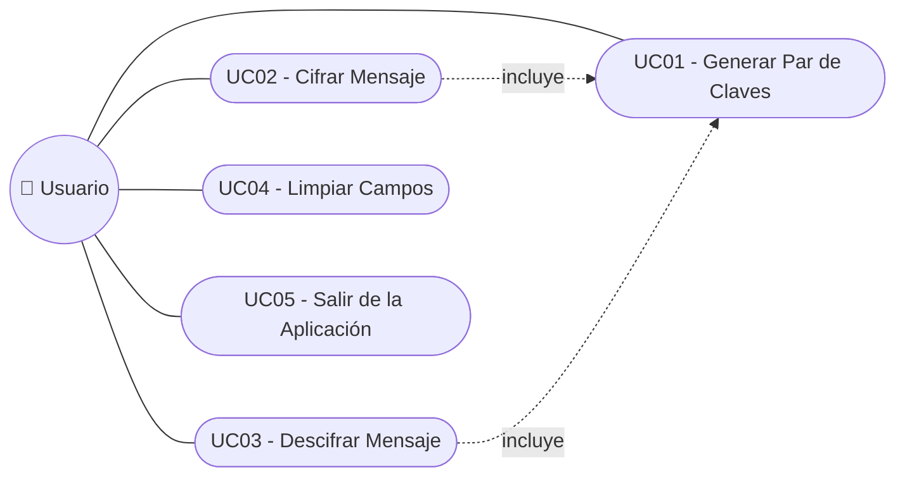
```mermaid
flowchart LR
    User((🧑 Usuario))

    UC1([UC01 - Generar Par de Claves])
    UC2([UC02 - Cifrar Mensaje])
    UC3([UC03 - Descifrar Mensaje])
    UC4([UC04 - Limpiar Campos])
    UC5([UC05 - Salir de la Aplicación])

    User --- UC1
    User --- UC2
    User --- UC3
    User --- UC4
    User --- UC5

    UC2 -. incluye .-> UC1
    UC3 -. incluye .-> UC1
```

### UC01 — Generar Par de Claves
| Campo | Descripción |
|:---|:---|
| **Actor** | Usuario |
| **Precondición** | La aplicación está abierta. |
| **Flujo Principal** | 1. El usuario hace clic en **"Generar Claves"**. 2. El sistema genera un par de claves RSA-2048. 3. El sistema muestra las claves pública y privada en Base64. |
| **Postcondición** | Hay un par de claves válido disponible para cifrar/descifrar. |

### UC02 — Cifrar Mensaje
| Campo | Descripción |
|:---|:---|
| **Actor** | Usuario |
| **Precondición** | Se ha generado un par de claves (RN01). |
| **Flujo Principal** | 1. El usuario escribe un mensaje. 2. El usuario hace clic en **"Cifrar"**. 3. El sistema genera una clave de sesión AES-256 aleatoria. 4. El sistema cifra el mensaje con AES. 5. El sistema cifra la clave AES con la clave pública RSA. 6. El sistema muestra ambas salidas cifradas. |
| **Flujo Alternativo** | Si no existe un par de claves, el sistema muestra un error (RF09). |
| **Postcondición** | Se muestran el mensaje cifrado y la clave de sesión cifrada. |

### UC03 — Descifrar Mensaje
| Campo | Descripción |
|:---|:---|
| **Actor** | Usuario |
| **Precondición** | Hay disponible un payload cifrado y la clave privada RSA (RN03). |
| **Flujo Principal** | 1. El usuario hace clic en **"Descifrar"**. 2. El sistema descifra la clave AES usando la clave privada RSA. 3. El sistema descifra el mensaje usando la clave AES recuperada. 4. El sistema muestra el texto original. |
| **Flujo Alternativo** | Si el descifrado falla (clave/datos incorrectos), el sistema muestra un error (RF09). |
| **Postcondición** | Se muestra el mensaje original. |

### UC04 — Limpiar Campos
| Campo | Descripción |
|:---|:---|
| **Actor** | Usuario |
| **Flujo Principal** | 1. El usuario hace clic en **"Limpiar"**. 2. El sistema restablece todas las áreas de texto a vacío. |
| **Postcondición** | La interfaz vuelve a su estado inicial (RN04). |

### UC05 — Salir de la Aplicación
| Campo | Descripción |
|:---|:---|
| **Actor** | Usuario |
| **Flujo Principal** | 1. El usuario hace clic en **"Salir"**. 2. El sistema cierra la ventana de la aplicación. |

</details>

---

## 3. Matriz de Trazabilidad de Requisitos 🔗

<details>
<summary><strong>Haz clic para expandir — Matriz de Trazabilidad</strong></summary>

| Requisito | Caso de Uso | Diagrama(s) | Verificación |
|:---|:---|:---|:---|
| RF01, RF02 | UC01 | Secuencia, Máquina de Estados, Clases | Prueba manual: clic en "Generar Claves" y verificar que se muestren las claves |
| RF03, RF04, RF05 | UC02 | Secuencia, Actividades, Clases, Casos de Uso | Prueba manual: cifrar un mensaje de ejemplo y verificar que se muestren el texto cifrado y la clave cifrada |
| RF06 | UC03 | Secuencia, Actividades, Máquina de Estados | Prueba manual: descifrar la salida anterior y verificar la recuperación del mensaje original |
| RF07 | UC04 | Máquina de Estados | Prueba manual: clic en "Limpiar" y verificar que los campos estén vacíos |
| RF08 | UC05 | Casos de Uso, Implementación (Deployment) | Prueba manual: clic en "Salir" y verificar el cierre de la aplicación |
| RF09 | UC02, UC03 | Actividades | Prueba manual: descifrar con datos inválidos y verificar el mensaje de error |
| RNF01, RNF02 | UC01, UC02 | Clases, Diccionario de Datos | Revisión de código de los tamaños de clave (RSA 2048 / AES 256) |
| RNF05 | UC02, UC03 | DFD, Linaje de Datos | Confirmar que no ocurren escrituras en archivo/BD |
| RN01–RN05 | UC01–UC04 | Máquina de Estados, Actividades | Prueba manual de las reglas de negocio |

</details>

---

## 4. Especificación de Requisitos de Software (SRS) 📄

<details>
<summary><strong>Haz clic para expandir — Resumen del SRS (estilo IEEE 830)</strong></summary>

### 4.1 Introducción
- **Propósito:** Especificar los requisitos del Programa de Cifrado Híbrido, una herramienta de escritorio educativa que demuestra el cifrado híbrido RSA + AES.
- **Alcance:** Aplicación de escritorio Java Swing, monousuario, sin conexión. Sin capa de red ni persistencia en la versión actual.
- **Definiciones:** *RSA* — algoritmo asimétrico Rivest-Shamir-Adleman. *AES* — Advanced Encryption Standard (algoritmo simétrico). *JCA* — Java Cryptography Architecture. *Clave de Sesión* — clave AES generada aleatoriamente y usada una sola vez por mensaje.

### 4.2 Descripción General
- **Perspectiva del Producto:** Aplicación JAR independiente, construida con Apache NetBeans/Ant.
- **Funciones del Producto:** Generación de claves, cifrado híbrido, descifrado híbrido, limpieza de campos, cierre de la aplicación (ver Sección 1.1).
- **Características del Usuario:** Estudiantes/desarrolladores que estudian criptografía aplicada; no se requiere experiencia previa en seguridad.
- **Restricciones:** Debe usar únicamente las APIs `java.security` / `javax.crypto` (JCA/JCE); debe ejecutarse en Java 8+.
- **Supuestos:** El usuario confía en su máquina local; la clave privada no está protegida por contraseña en esta versión.

### 4.3 Requisitos Específicos
- Ver [Sección 1 — Requisitos](#1-requisitos-) para el desglose completo de RF / RNF / RN / Dominio / Datos / Interfaz.
- Ver [Sección 2 — Casos de Uso](#2-casos-de-uso-) para las especificaciones de comportamiento.

### 4.4 Apéndices
- Ver [Sección 5 — Diagramas UML & Estructurales](#5-diagramas-uml--estructurales-) y [Sección 6 — Modelo de Datos & Diccionario de Datos](#6-modelo-de-datos--diccionario-de-datos-).

</details>

---

## 5. Diagramas UML & Estructurales 🏗️

<details>
<summary><strong>5.1 Diagrama de Casos de Uso</strong></summary>

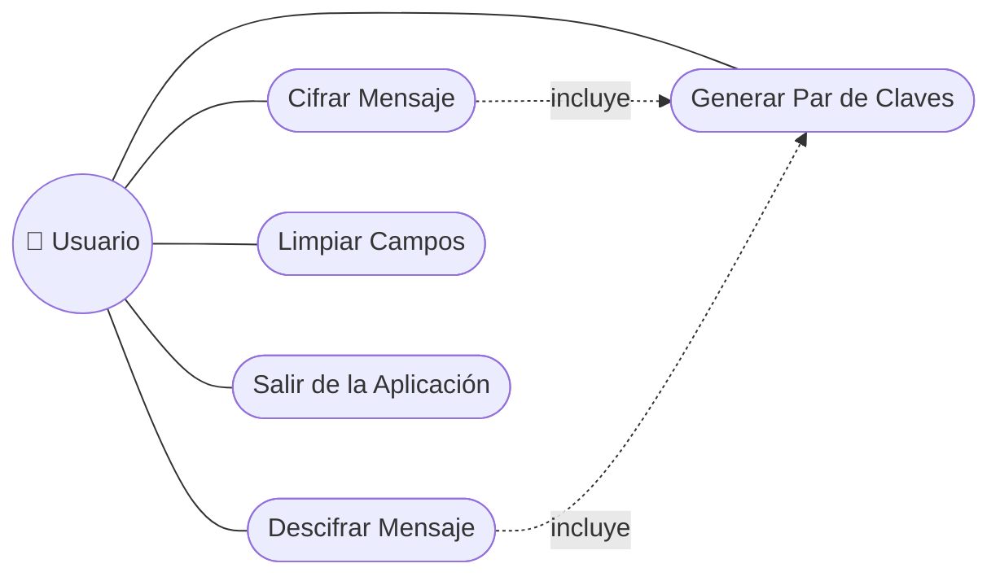
```mermaid
flowchart LR
    User((🧑 Usuario))
    UC1([Generar Par de Claves])
    UC2([Cifrar Mensaje])
    UC3([Descifrar Mensaje])
    UC4([Limpiar Campos])
    UC5([Salir de la Aplicación])

    User --- UC1
    User --- UC2
    User --- UC3
    User --- UC4
    User --- UC5
    UC2 -. incluye .-> UC1
    UC3 -. incluye .-> UC1
```
</details>

<details>
<summary><strong>5.2 Diagrama de Clases</strong></summary>

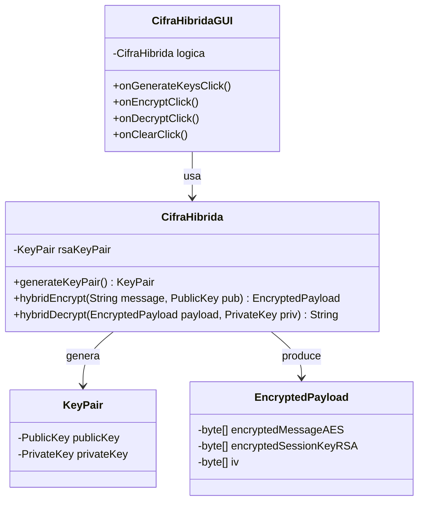
```mermaid
classDiagram
    class CifraHibridaGUI {
        -CifraHibrida logica
        +onGenerateKeysClick()
        +onEncryptClick()
        +onDecryptClick()
        +onClearClick()
    }
    class CifraHibrida {
        -KeyPair rsaKeyPair
        +generateKeyPair() KeyPair
        +hybridEncrypt(String message, PublicKey pub) EncryptedPayload
        +hybridDecrypt(EncryptedPayload payload, PrivateKey priv) String
    }
    class EncryptedPayload {
        -byte[] encryptedMessageAES
        -byte[] encryptedSessionKeyRSA
        -byte[] iv
    }
    class KeyPair {
        -PublicKey publicKey
        -PrivateKey privateKey
    }
    CifraHibridaGUI --> CifraHibrida : usa
    CifraHibrida --> KeyPair : genera
    CifraHibrida --> EncryptedPayload : produce
```
</details>

<details>
<summary><strong>5.3 Diagrama de Objetos</strong></summary>

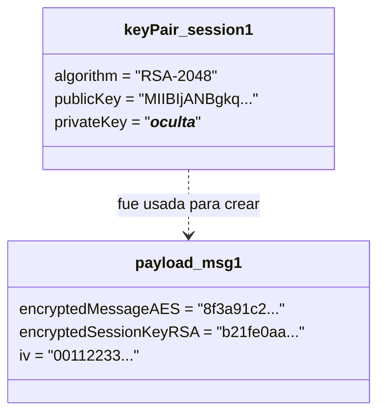
```mermaid
classDiagram
    class keyPair_session1 {
        algorithm = "RSA-2048"
        publicKey = "MIIBIjANBgkq..."
        privateKey = "***oculta***"
    }
    class payload_msg1 {
        encryptedMessageAES = "8f3a91c2..."
        encryptedSessionKeyRSA = "b21fe0aa..."
        iv = "00112233..."
    }
    keyPair_session1 ..> payload_msg1 : fue usada para crear
```
*Instantánea de instancias de una sola operación de cifrado en tiempo de ejecución.*
</details>

<details>
<summary><strong>5.4 Diagrama de Secuencia</strong></summary>

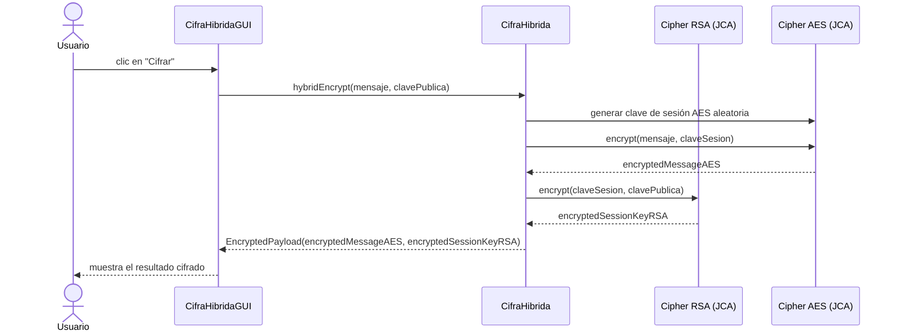
```mermaid
sequenceDiagram
    actor U as Usuario
    participant GUI as CifraHibridaGUI
    participant LOG as CifraHibrida
    participant RSA as Cipher RSA (JCA)
    participant AES as Cipher AES (JCA)

    U->>GUI: clic en "Cifrar"
    GUI->>LOG: hybridEncrypt(mensaje, clavePublica)
    LOG->>AES: generar clave de sesión AES aleatoria
    LOG->>AES: encrypt(mensaje, claveSesion)
    AES-->>LOG: encryptedMessageAES
    LOG->>RSA: encrypt(claveSesion, clavePublica)
    RSA-->>LOG: encryptedSessionKeyRSA
    LOG-->>GUI: EncryptedPayload(encryptedMessageAES, encryptedSessionKeyRSA)
    GUI-->>U: muestra el resultado cifrado
```
</details>

<details>
<summary><strong>5.5 Diagrama de Comunicación (Colaboración)</strong></summary>

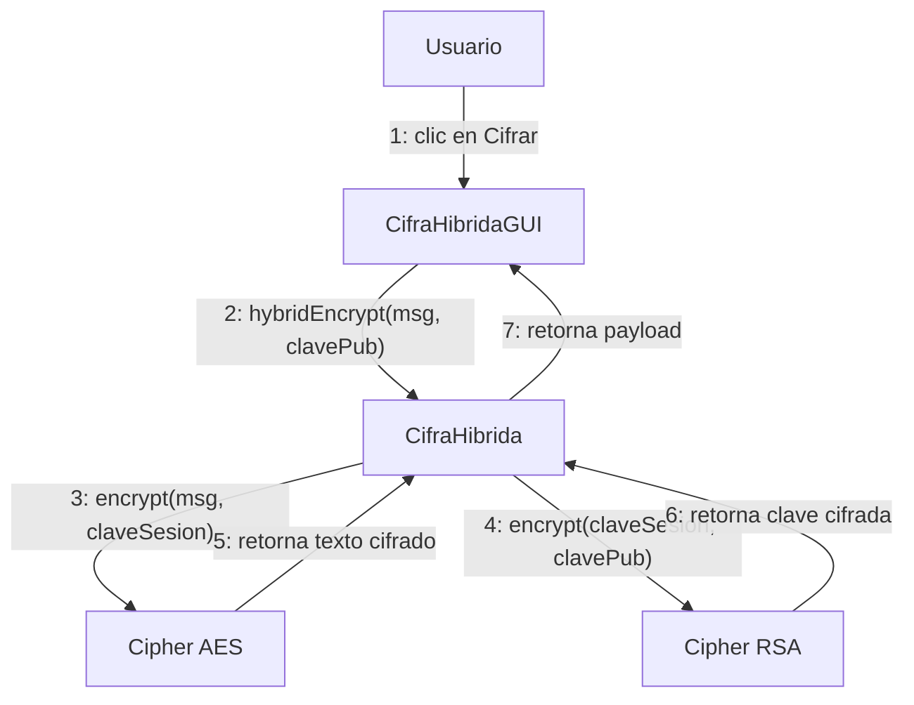
```mermaid
flowchart TD
    U[Usuario]
    GUI[CifraHibridaGUI]
    LOG[CifraHibrida]
    AES[Cipher AES]
    RSA[Cipher RSA]

    U -- "1: clic en Cifrar" --> GUI
    GUI -- "2: hybridEncrypt(msg, clavePub)" --> LOG
    LOG -- "3: encrypt(msg, claveSesion)" --> AES
    LOG -- "4: encrypt(claveSesion, clavePub)" --> RSA
    AES -- "5: retorna texto cifrado" --> LOG
    RSA -- "6: retorna clave cifrada" --> LOG
    LOG -- "7: retorna payload" --> GUI
```
</details>

<details>
<summary><strong>5.6 Diagrama de Actividades</strong></summary>

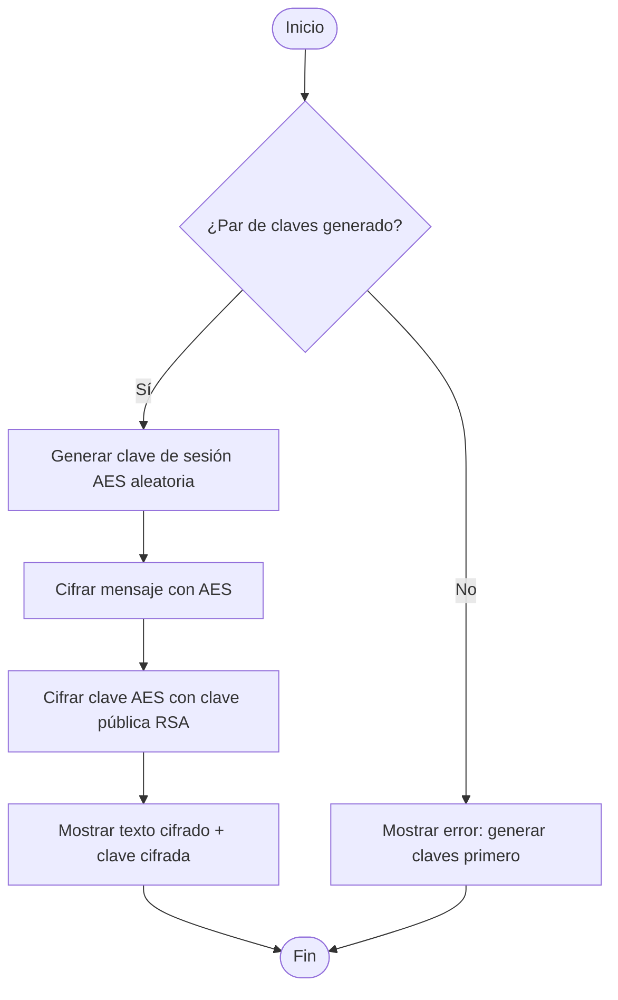
```mermaid
flowchart TD
    Start([Inicio]) --> A{¿Par de claves generado?}
    A -- No --> Err1[Mostrar error: generar claves primero]
    A -- Sí --> B[Generar clave de sesión AES aleatoria]
    B --> C[Cifrar mensaje con AES]
    C --> D[Cifrar clave AES con clave pública RSA]
    D --> E[Mostrar texto cifrado + clave cifrada]
    E --> Fin([Fin])
    Err1 --> Fin
```
</details>

<details>
<summary><strong>5.7 Diagrama de Máquina de Estados</strong></summary>

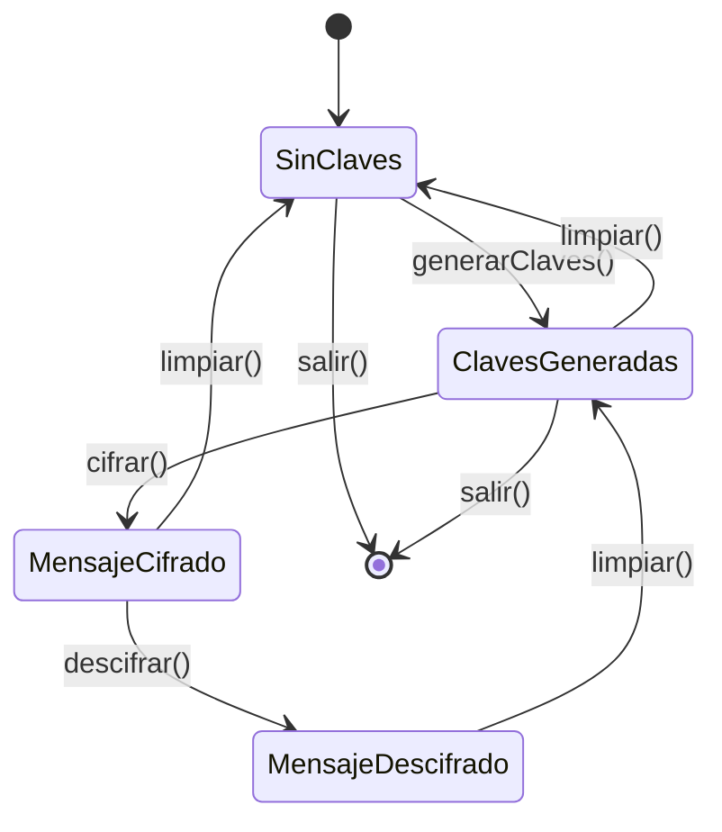
```mermaid
stateDiagram-v2
    [*] --> SinClaves
    SinClaves --> ClavesGeneradas : generarClaves()
    ClavesGeneradas --> MensajeCifrado : cifrar()
    MensajeCifrado --> MensajeDescifrado : descifrar()
    MensajeDescifrado --> ClavesGeneradas : limpiar()
    ClavesGeneradas --> SinClaves : limpiar()
    MensajeCifrado --> SinClaves : limpiar()
    SinClaves --> [*] : salir()
    ClavesGeneradas --> [*] : salir()
```
</details>

<details>
<summary><strong>5.8 Diagrama de Componentes</strong></summary>

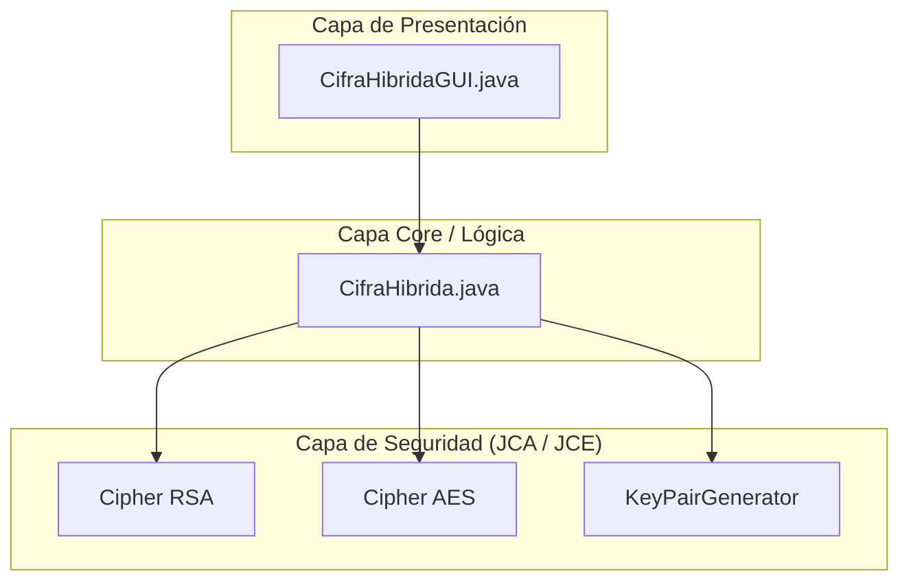
```mermaid
flowchart TB
    subgraph Presentacion["Capa de Presentación"]
        GUI[CifraHibridaGUI.java]
    end
    subgraph Nucleo["Capa Core / Lógica"]
        LOG[CifraHibrida.java]
    end
    subgraph Seguridad["Capa de Seguridad (JCA / JCE)"]
        RSA[Cipher RSA]
        AES[Cipher AES]
        KG[KeyPairGenerator]
    end

    GUI --> LOG
    LOG --> RSA
    LOG --> AES
    LOG --> KG
```
</details>

<details>
<summary><strong>5.9 Diagrama de Implementación (Deployment)</strong></summary>

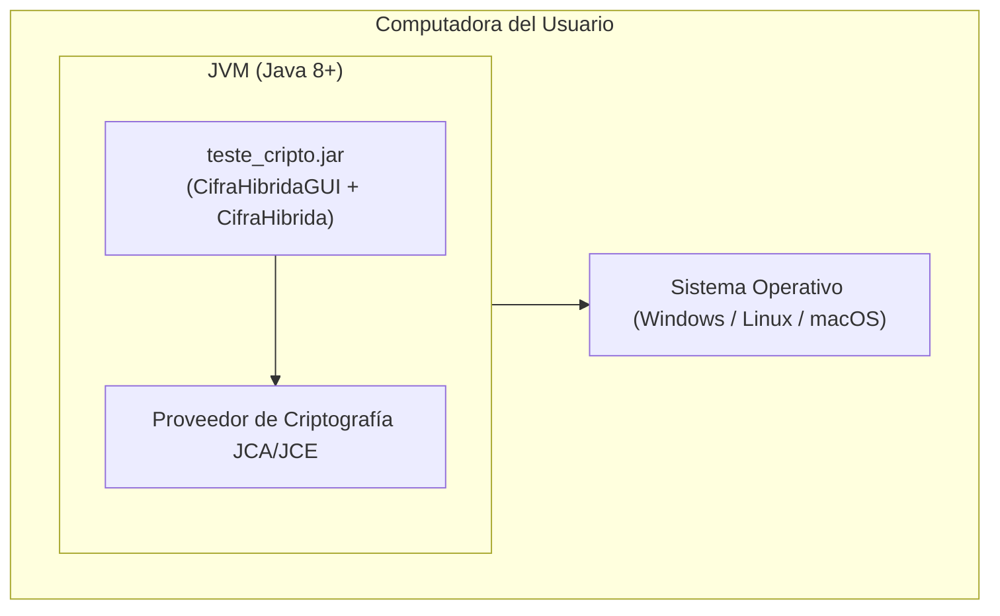
```mermaid
flowchart TB
    subgraph Maquina["Computadora del Usuario"]
        subgraph JVM["JVM (Java 8+)"]
            JAR["teste_cripto.jar\n(CifraHibridaGUI + CifraHibrida)"]
            JCA["Proveedor de Criptografía JCA/JCE"]
        end
        OS["Sistema Operativo (Windows / Linux / macOS)"]
    end

    JAR --> JCA
    JVM --> OS
```
</details>

<details>
<summary><strong>5.10 Diagrama de Paquetes</strong></summary>

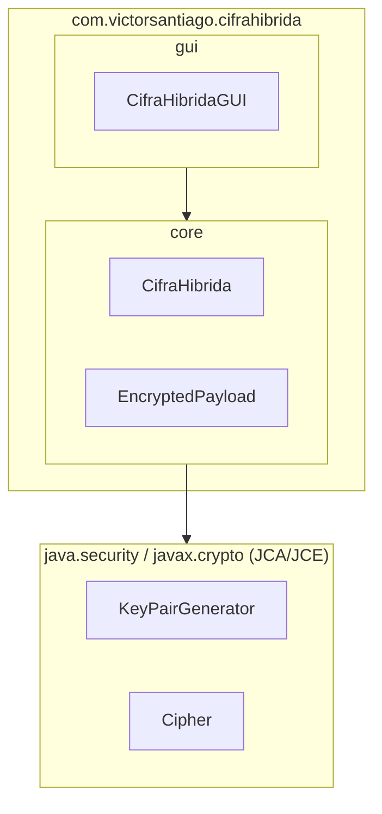
```mermaid
flowchart TB
    subgraph app["com.victorsantiago.cifrahibrida"]
        subgraph gui["gui"]
            G1[CifraHibridaGUI]
        end
        subgraph core["core"]
            C1[CifraHibrida]
            C2[EncryptedPayload]
        end
    end
    subgraph jca["java.security / javax.crypto (JCA/JCE)"]
        K1[KeyPairGenerator]
        K2[Cipher]
    end

    gui --> core
    core --> jca
```
</details>

<details>
<summary><strong>5.11 Diagrama de Estructura Compuesta</strong></summary>

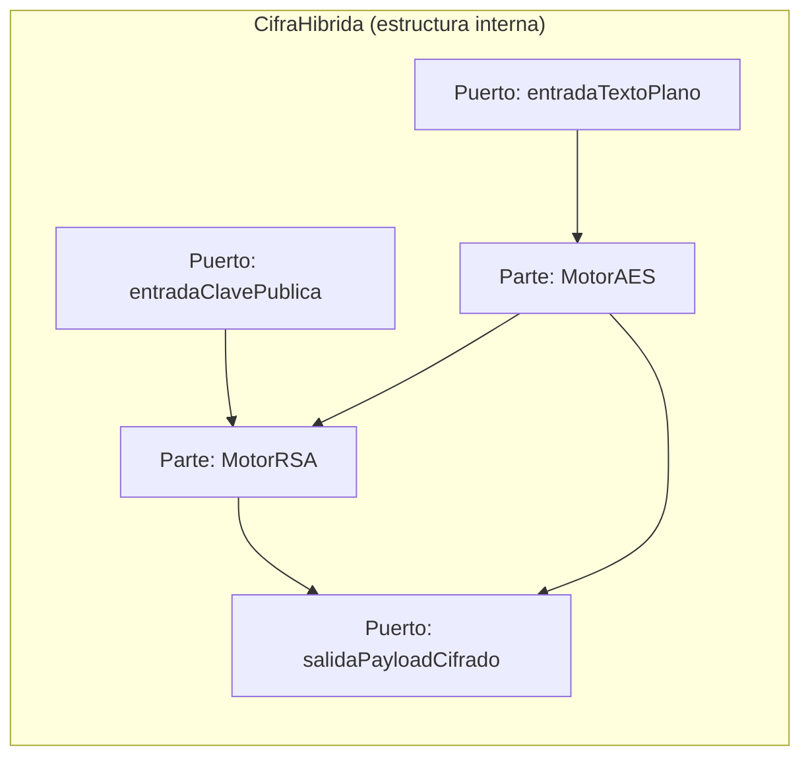
```mermaid
flowchart TB
    subgraph CifraHibrida["CifraHibrida (estructura interna)"]
        direction TB
        P1["Puerto: entradaTextoPlano"]
        P2["Puerto: entradaClavePublica"]
        P3["Parte: MotorAES"]
        P4["Parte: MotorRSA"]
        P5["Puerto: salidaPayloadCifrado"]

        P1 --> P3
        P2 --> P4
        P3 --> P4
        P4 --> P5
        P3 --> P5
    end
```
</details>

<details>
<summary><strong>5.12 Diagrama de Visión General de Interacción</strong></summary>

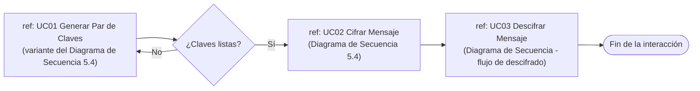
```mermaid
flowchart LR
    A["ref: UC01 Generar Par de Claves\n(variante del Diagrama de Secuencia 5.4)"] --> B{¿Claves listas?}
    B -- Sí --> C["ref: UC02 Cifrar Mensaje\n(Diagrama de Secuencia 5.4)"]
    B -- No --> A
    C --> D["ref: UC03 Descifrar Mensaje\n(Diagrama de Secuencia - flujo de descifrado)"]
    D --> E([Fin de la interacción])
```
</details>

<details>
<summary><strong>5.13 Diagrama de Tiempo (Timing)</strong></summary>

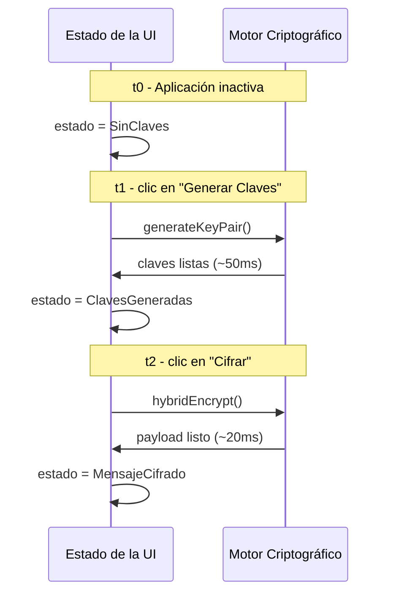
```mermaid
sequenceDiagram
    participant UI as Estado de la UI
    participant CR as Motor Criptográfico

    Note over UI,CR: t0 - Aplicación inactiva
    UI->>UI: estado = SinClaves
    Note over UI,CR: t1 - clic en "Generar Claves"
    UI->>CR: generateKeyPair()
    CR->>UI: claves listas (~50ms)
    UI->>UI: estado = ClavesGeneradas
    Note over UI,CR: t2 - clic en "Cifrar"
    UI->>CR: hybridEncrypt()
    CR->>UI: payload listo (~20ms)
    UI->>UI: estado = MensajeCifrado
```
</details>

---

## 6. Modelo de Datos & Diccionario de Datos 🗄️

<details>
<summary><strong>Haz clic para expandir — DER, Modelos Conceptual/Lógico/Físico y Diccionario de Datos</strong></summary>

### 6.1 Diagrama Entidad-Relación (DER)

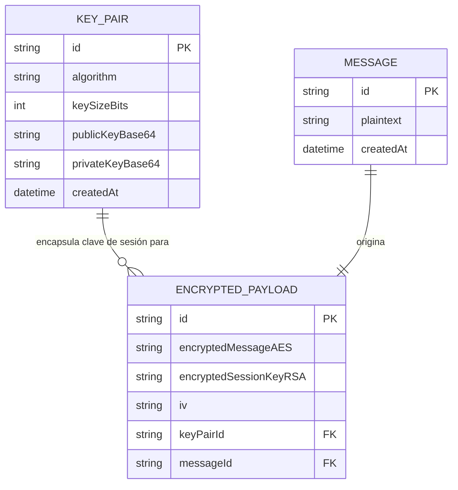
```mermaid
erDiagram
    KEY_PAIR {
        string id PK
        string algorithm
        int keySizeBits
        string publicKeyBase64
        string privateKeyBase64
        datetime createdAt
    }
    MESSAGE {
        string id PK
        string plaintext
        datetime createdAt
    }
    ENCRYPTED_PAYLOAD {
        string id PK
        string encryptedMessageAES
        string encryptedSessionKeyRSA
        string iv
        string keyPairId FK
        string messageId FK
    }

    KEY_PAIR ||--o{ ENCRYPTED_PAYLOAD : "encapsula clave de sesión para"
    MESSAGE  ||--|| ENCRYPTED_PAYLOAD : "origina"
```

### 6.2 Modelo Conceptual de Datos
Una vista simplificada e independiente de la tecnología: un **Usuario** genera un **Par de Claves**, escribe un **Mensaje** y produce un **Payload Cifrado** que reúne el texto cifrado AES con la clave AES encapsulada mediante RSA.

### 6.3 Modelo Lógico de Datos
| Entidad | Atributo | Tipo | Notas |
|:---|:---|:---|:---|
| KeyPair | id | UUID | Generado por sesión |
| KeyPair | algorithm | String | "RSA" |
| KeyPair | keySizeBits | Integer | 2048 (RNF01) |
| KeyPair | publicKeyBase64 | String | Mostrada al usuario |
| KeyPair | privateKeyBase64 | String | Mostrada al usuario (solo local) |
| Message | plaintext | String (UTF-8) | Entrada del usuario |
| EncryptedPayload | encryptedMessageAES | byte[] / Base64 | Texto cifrado AES-256 |
| EncryptedPayload | encryptedSessionKeyRSA | byte[] / Base64 | Clave AES encapsulada vía RSA |
| EncryptedPayload | iv | byte[] / Base64 | Vector de inicialización (si modo CBC) |

### 6.4 Modelo Físico de Datos
La versión actual es **solo en memoria** (RNF05/RDA04) — no se persiste ninguna tabla. Si se añadiera persistencia, el modelo anterior se mapea directamente a tablas relacionales (`key_pair`, `message`, `encrypted_payload`) con columnas `VARCHAR`/`BLOB` correspondientes al Modelo Lógico de Datos.

### 6.5 Diccionario de Datos

| Campo | Tipo | Descripción | Restricciones |
|:---|:---|:---|:---|
| `publicKey` | `java.security.PublicKey` | Clave pública RSA, compartible | Algoritmo = RSA, tamaño = 2048 bits |
| `privateKey` | `java.security.PrivateKey` | Clave privada RSA, secreta | Nunca se transmite (RN05) |
| `sessionKey` | `javax.crypto.SecretKey` | Clave AES, generada por mensaje | Algoritmo = AES, tamaño = 256 bits, uso único (RN02) |
| `plaintext` | `String` | Mensaje original del usuario | Codificado en UTF-8 |
| `encryptedMessageAES` | `byte[]` | Texto cifrado de `plaintext` | Salida del cipher AES |
| `encryptedSessionKeyRSA` | `byte[]` | `sessionKey` cifrada con `publicKey` | Salida del cipher RSA |

</details>

---

## 7. Diagrama de Flujo de Datos (DFD) & Linaje de Datos 🔄

<details>
<summary><strong>Haz clic para expandir — DFD Nivel 0/1 y Linaje de Datos</strong></summary>

### 7.1 Diagrama de Flujo de Datos (Nivel 0/1)

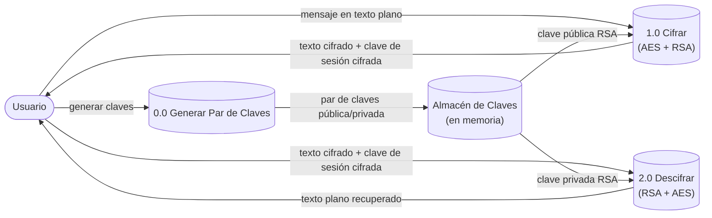
```mermaid
flowchart LR
    U([Usuario]) -->|mensaje en texto plano| P1[("1.0 Cifrar\n(AES + RSA)")]
    KS[("Almacén de Claves\n(en memoria)")] -->|clave pública RSA| P1
    P1 -->|texto cifrado + clave de sesión cifrada| U

    U -->|texto cifrado + clave de sesión cifrada| P2[("2.0 Descifrar\n(RSA + AES)")]
    KS -->|clave privada RSA| P2
    P2 -->|texto plano recuperado| U

    U -->|"generar claves"| P0[("0.0 Generar Par de Claves")]
    P0 -->|par de claves pública/privada| KS
```

### 7.2 Diagrama de Linaje de Datos

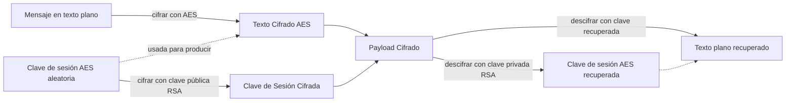
```mermaid
flowchart LR
    A[Mensaje en texto plano] -->|cifrar con AES| B[Texto Cifrado AES]
    C[Clave de sesión AES aleatoria] -->|cifrar con clave pública RSA| D[Clave de Sesión Cifrada]
    C -.->|usada para producir| B
    B --> E[Payload Cifrado]
    D --> E
    E -->|descifrar con clave privada RSA| C2[Clave de sesión AES recuperada]
    E -->|descifrar con clave recuperada| A2[Texto plano recuperado]
    C2 -.-> A2
```

</details>

---

## 8. Diagrama de Arquitectura & Diagrama de Flujo 🏛️

<details>
<summary><strong>Haz clic para expandir — Visión General de la Arquitectura y Diagrama de Flujo Principal</strong></summary>

### 8.1 Diagrama de Arquitectura

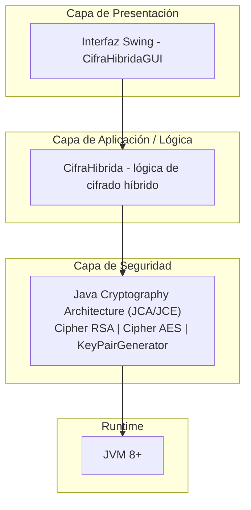
```mermaid
flowchart TB
    subgraph L1["Capa de Presentación"]
        UI[Interfaz Swing - CifraHibridaGUI]
    end
    subgraph L2["Capa de Aplicación / Lógica"]
        LOGIC[CifraHibrida - lógica de cifrado híbrido]
    end
    subgraph L3["Capa de Seguridad"]
        JCA["Java Cryptography Architecture (JCA/JCE)\nCipher RSA | Cipher AES | KeyPairGenerator"]
    end
    subgraph L4["Runtime"]
        JVM["JVM 8+"]
    end

    UI --> LOGIC --> JCA --> JVM
```

### 8.2 Diagrama de Flujo Principal (Ciclo de Cifrado / Descifrado)

```mermaid
flowchart TD
    Start([Abrir Aplicación]) --> Gen[Clic en "Generar Claves"]
    Gen --> Type[Escribir mensaje]
    Type --> Enc[Clic en "Cifrar"]
    Enc --> Out1[Ver texto cifrado AES + clave cifrada RSA]
    Out1 --> Share{¿Compartir con el destinatario?}
    Share -- Sí --> Dec[Clic en "Descifrar" con clave privada]
    Share -- No --> Clear[Clic en "Limpiar"]
    Dec --> Out2[Ver mensaje original recuperado]
    Out2 --> Clear
    Clear --> Decide{¿Continuar?}
    Decide -- Sí --> Type
    Decide -- No --> Exit([Clic en "Salir"])
```

</details>

---

## 9. Persona & Mapa de Viaje del Usuario 👤

<details>
<summary><strong>Haz clic para expandir — Persona y Mapa de Viaje del Usuario</strong></summary>

### 9.1 Persona

| | |
|:---|:---|
| **Nombre** | Ana Souza |
| **Rol** | Estudiante de Ciencias de la Computación / desarrolladora backend junior |
| **Objetivo** | Entender, de forma práctica, cómo funciona el cifrado híbrido (RSA + AES) antes de aplicarlo en un proyecto real. |
| **Nivel Técnico** | Cómoda con Java, nueva en criptografía aplicada (JCA/JCE). |
| **Frustraciones** | La teoría de criptografía parece abstracta; quiere una herramienta visual, clic a clic, para ver claves y textos cifrados. |
| **Motivación** | Necesita aprobar una actividad del curso de Seguridad y construir un proyecto de portafolio. |

### 9.2 Mapa de Viaje del Usuario

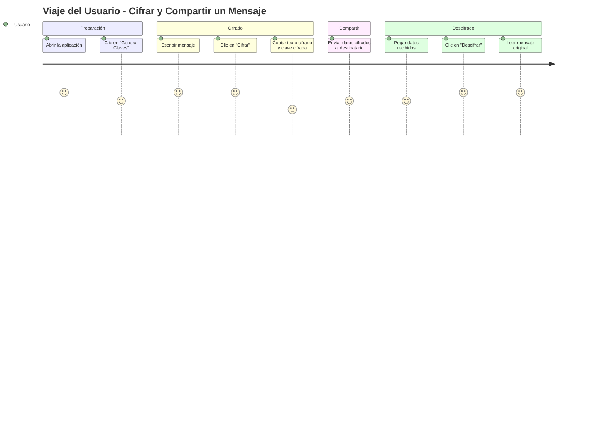
```mermaid
journey
    title Viaje del Usuario - Cifrar y Compartir un Mensaje
    section Preparación
      Abrir la aplicación: 5: Usuario
      Clic en "Generar Claves": 4: Usuario
    section Cifrado
      Escribir mensaje: 5: Usuario
      Clic en "Cifrar": 5: Usuario
      Copiar texto cifrado y clave cifrada: 3: Usuario
    section Compartir
      Enviar datos cifrados al destinatario: 4: Usuario
    section Descifrado
      Pegar datos recibidos: 4: Usuario
      Clic en "Descifrar": 5: Usuario
      Leer mensaje original: 5: Usuario
```

</details>

---

## 10. Wireframes & Mockups 🖼️

<details>
<summary><strong>Haz clic para expandir — Wireframe de la Interfaz</strong></summary>

```
┌──────────────────────────────────────────────────────────────┐
│  🔒 Programa de Cifrado Híbrido — RSA + AES                    │
├──────────────────────────────────────────────────────────────┤
│  Clave Pública:  [ área de texto solo lectura, Base64       ]  │
│  Clave Privada:  [ área de texto solo lectura, Base64       ]  │
│                                       [ 🗝️ Generar Claves ]    │
├──────────────────────────────────────────────────────────────┤
│  Mensaje:        [ área de texto multilínea de entrada      ]  │
│                                       [ 🔒 Cifrar ]            │
│  Cifrado (AES):       [ área de texto solo lectura, Base64   ]│
│  Clave Cifrada (RSA): [ área de texto solo lectura, Base64   ]│
├──────────────────────────────────────────────────────────────┤
│                                       [ 🔓 Descifrar ]         │
│  Mensaje Descifrado:  [ área de texto solo lectura          ]│
├──────────────────────────────────────────────────────────────┤
│              [ 🧹 Limpiar ]                [ 🚪 Salir ]        │
└──────────────────────────────────────────────────────────────┘
```

*El mockup refleja el diseño real en Swing de `CifraHibridaGUI`: áreas de texto para claves, mensaje y resultados, además de los botones de acción (Generar Claves, Cifrar, Descifrar, Limpiar, Salir).*

</details>

---

## 🚀 Instalación & Ejecución

### Requisitos Previos
- **Java JDK 8+**
- **Apache NetBeans** *(opcional, solo necesario para compilar desde el IDE)*
- **Git**

### Opción 1 — Ejecutar el JAR precompilado (recomendado)

```bash
git clone https://github.com/VictorHJesusSantiago/programa_criptografico_chaves.git
cd programa_criptografico_chaves/teste_cripto/dist
java -jar teste_cripto.jar
```

### Opción 2 — Compilar y ejecutar con NetBeans

```
1. Abre Apache NetBeans IDE
2. File → Open Project...
3. Selecciona la carpeta 'teste_cripto'
4. Haz clic en "Run Project" (F6)
```

### Cómo Usar

| Paso | Acción |
|:-:|:---|
| 1️⃣ | Haz clic en **Generar Claves** para crear el par de claves RSA. |
| 2️⃣ | Escribe el mensaje que deseas proteger. |
| 3️⃣ | Haz clic en **Cifrar** — se muestran el texto cifrado AES y la clave de sesión cifrada con RSA. |
| 4️⃣ | Haz clic en **Descifrar** para recuperar el mensaje original usando la clave privada. |
| 5️⃣ | Usa **Limpiar** para restablecer todos los campos, o **Salir** para cerrar la aplicación. |

---

## 👨‍💻 Autor

<div align="center">

**Victor Henrique de Jesus Santiago**
Full Stack Developer

[](mailto:victorhenriquedejesussantiago@gmail.com)
[](https://www.linkedin.com/in/victor-henrique-de-jesus-santiago/)
[](https://github.com/VictorHJesusSantiago)

</div>

---

<div align="center">

*Hecho con 🔒 y Java por **Victor H. J. Santiago***

</div>
