<div align="center">


# 🔒 Programa de Cifra Híbrida — RSA + AES

**Uma aplicação desktop em Java Swing que demonstra a criptografia híbrida,**
**combinando criptografia assimétrica (RSA) e simétrica (AES) para proteger mensagens.**


### 🌐 Choose Language / Selecione o idioma / Elija el idioma

[](README.md)
[](README_PT.md)
[](README_ES.md)

</div>

---

## 📖 Sobre o Projeto

O **Programa de Cifra Híbrida** é uma aplicação desktop construída em **Java Swing** que demonstra, na prática, a mesma estratégia criptográfica utilizada em protocolos como **TLS/HTTPS**: cifrar a mensagem com um algoritmo simétrico rápido (**AES**) e proteger a chave simétrica com um algoritmo assimétrico mais seguro (**RSA**).

Este repositório também documenta o projeto seguindo um ciclo completo de Engenharia de Software — requisitos, casos de uso, diagramas UML, modelagem de dados, arquitetura, personas e wireframes — para fins acadêmicos e de portfólio.

---

## 📚 Sumário

- [1. Requisitos](#1-requisitos-)
- [2. Casos de Uso](#2-casos-de-uso-)
- [3. Matriz de Rastreabilidade de Requisitos](#3-matriz-de-rastreabilidade-de-requisitos-)
- [4. Documento de Especificação de Requisitos de Software (SRS)](#4-documento-de-especificação-de-requisitos-de-software-srs-)
- [5. Diagramas UML & Estruturais](#5-diagramas-uml--estruturais-)
- [6. Modelo de Dados & Dicionário de Dados](#6-modelo-de-dados--dicionário-de-dados-)
- [7. Diagrama de Fluxo de Dados (DFD) & Linhagem de Dados](#7-diagrama-de-fluxo-de-dados-dfd--linhagem-de-dados-)
- [8. Diagrama de Arquitetura & Fluxograma](#8-diagrama-de-arquitetura--fluxograma-)
- [9. Persona & Mapa de Jornada do Usuário](#9-persona--mapa-de-jornada-do-usuário-)
- [10. Wireframes & Mockups](#10-wireframes--mockups-)
- [Instalação & Execução](#-instalação--execução)
- [Autor](#-autor)

---

## 1. Requisitos 📋

<details>
<summary><strong>Clique para expandir — Requisitos Funcionais, Não Funcionais, Regras de Negócio, Domínio, Dados e Interface</strong></summary>

### 1.1 Requisitos Funcionais (RF)

| ID | Requisito |
|:---|:---|
| RF01 | O sistema **deve gerar** um par de chaves RSA (pública/privada) sob demanda. |
| RF02 | O sistema **deve exibir** as chaves pública e privada geradas na tela. |
| RF03 | O sistema **deve permitir** que o usuário digite uma mensagem em texto puro. |
| RF04 | O sistema **deve cifrar** a mensagem usando um esquema híbrido: AES para a mensagem, RSA para a chave AES. |
| RF05 | O sistema **deve exibir** a mensagem cifrada com AES e a chave de sessão cifrada com RSA. |
| RF06 | O sistema **deve decifrar** um payload cifrado usando a chave privada RSA, recuperando a chave AES e, em seguida, a mensagem original. |
| RF07 | O sistema **deve permitir** limpar todos os campos de texto com uma única ação. |
| RF08 | O sistema **deve permitir** que o usuário encerre a aplicação. |
| RF09 | O sistema **deve informar** o usuário quando uma operação não puder ser concluída (ex.: decifrar sem uma chave válida). |

### 1.2 Requisitos Não Funcionais (RNF)

| ID | Requisito |
|:---|:---|
| RNF01 | As chaves RSA **devem ter no mínimo 2048 bits**. |
| RNF02 | As chaves de sessão AES **devem usar 256 bits**. |
| RNF03 | A aplicação **deve executar** em qualquer SO com Java 8+ instalado (portabilidade). |
| RNF04 | A interface **deve responder** às ações do usuário em menos de 1 segundo para mensagens de tamanho típico. |
| RNF05 | A aplicação **não deve persistir** chaves ou mensagens em disco (confidencialidade por padrão). |
| RNF06 | A interface **deve ser simples** o suficiente para um usuário sem conhecimento prévio em criptografia. |
| RNF07 | O código **deve depender apenas** da Java Cryptography Architecture (JCA) padrão, sem bibliotecas externas. |

### 1.3 Regras de Negócio (RN)

| ID | Regra |
|:---|:---|
| RN01 | Uma mensagem **não pode ser cifrada** antes de um par de chaves RSA ser gerado. |
| RN02 | Toda operação de cifragem **deve gerar uma nova chave de sessão AES aleatória** — chaves nunca são reutilizadas. |
| RN03 | A decifragem **requer tanto** o payload cifrado (texto cifrado AES + chave AES cifrada) **quanto** a chave privada RSA correspondente. |
| RN04 | A ação "Limpar" **reinicia o estado da interface** sem deixar dados residuais visíveis. |
| RN05 | A chave pública pode ser livremente compartilhada; a chave privada **nunca deve** sair da aplicação local. |

### 1.4 Requisitos de Domínio

| ID | Requisito |
|:---|:---|
| RD01 | O sistema opera no domínio de **Criptografia** e deve implementar corretamente o padrão de **Cifra Híbrida** (encapsulamento de chave assimétrica + cifragem simétrica do payload). |
| RD02 | As operações RSA devem seguir a geração de chaves e transformações de cifra padrão da **JCA** (`RSA/ECB/PKCS1Padding` ou equivalente). |
| RD03 | As operações AES devem usar um **modo de cifra de bloco** válido (ex.: `AES/ECB/PKCS5Padding` ou `AES/CBC/PKCS5Padding`) consistente entre cifragem e decifragem. |

### 1.5 Requisitos de Dados

| ID | Requisito |
|:---|:---|
| RDA01 | As chaves são representadas internamente como `PublicKey` / `PrivateKey` (`java.security`) e exibidas como **strings em Base64**. |
| RDA02 | As mensagens são tratadas como **strings codificadas em UTF-8**. |
| RDA03 | A saída cifrada (texto cifrado + chave de sessão cifrada) é representada como **arrays de bytes** e exibida em Base64. |
| RDA04 | Nenhum dado é gravado em armazenamento permanente na versão atual — todos os dados são **em memória / por sessão**. |

### 1.6 Requisitos de Interface

| ID | Requisito |
|:---|:---|
| RI01 | Uma janela única em **Swing** com componentes `JTextArea` de entrada/saída e botões `JButton` de ação. |
| RI02 | Botões: **Gerar Chaves**, **Cifrar**, **Decifrar**, **Limpar**, **Sair**. |
| RI03 | Os campos de saída são **somente leitura** e selecionáveis para copiar/colar. |
| RI04 | O layout deve permanecer usável ao ser redimensionado (layout managers responsivos do Swing). |

</details>

---

## 2. Casos de Uso 🧩

<details>
<summary><strong>Clique para expandir — Especificações dos Casos de Uso</strong></summary>

### Diagrama de Casos de Uso

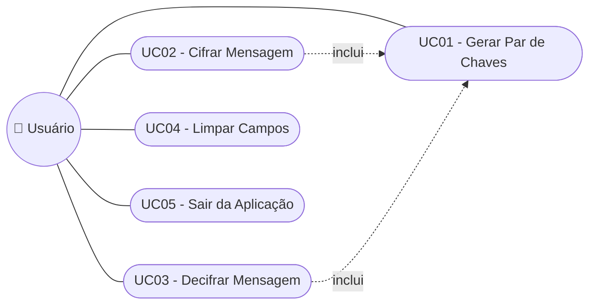
```mermaid
flowchart LR
    User((🧑 Usuário))

    UC1([UC01 - Gerar Par de Chaves])
    UC2([UC02 - Cifrar Mensagem])
    UC3([UC03 - Decifrar Mensagem])
    UC4([UC04 - Limpar Campos])
    UC5([UC05 - Sair da Aplicação])

    User --- UC1
    User --- UC2
    User --- UC3
    User --- UC4
    User --- UC5

    UC2 -. inclui .-> UC1
    UC3 -. inclui .-> UC1
```

### UC01 — Gerar Par de Chaves
| Campo | Descrição |
|:---|:---|
| **Ator** | Usuário |
| **Pré-condição** | Aplicação está aberta. |
| **Fluxo Principal** | 1. Usuário clica em **"Gerar Chaves"**. 2. Sistema gera um par de chaves RSA-2048. 3. Sistema exibe as chaves pública e privada em Base64. |
| **Pós-condição** | Um par de chaves válido está disponível para cifragem/decifragem. |

### UC02 — Cifrar Mensagem
| Campo | Descrição |
|:---|:---|
| **Ator** | Usuário |
| **Pré-condição** | Um par de chaves foi gerado (RN01). |
| **Fluxo Principal** | 1. Usuário digita uma mensagem. 2. Usuário clica em **"Cifrar"**. 3. Sistema gera uma chave de sessão AES-256 aleatória. 4. Sistema cifra a mensagem com AES. 5. Sistema cifra a chave AES com a chave pública RSA. 6. Sistema exibe ambas as saídas cifradas. |
| **Fluxo Alternativo** | Se não houver par de chaves, o sistema exibe um erro (RF09). |
| **Pós-condição** | A mensagem cifrada e a chave de sessão cifrada são exibidas. |

### UC03 — Decifrar Mensagem
| Campo | Descrição |
|:---|:---|
| **Ator** | Usuário |
| **Pré-condição** | Um payload cifrado e a chave privada RSA estão disponíveis (RN03). |
| **Fluxo Principal** | 1. Usuário clica em **"Decifrar"**. 2. Sistema decifra a chave AES usando a chave privada RSA. 3. Sistema decifra a mensagem usando a chave AES recuperada. 4. Sistema exibe o texto original. |
| **Fluxo Alternativo** | Se a decifragem falhar (chave/dados incorretos), o sistema exibe um erro (RF09). |
| **Pós-condição** | A mensagem original é exibida. |

### UC04 — Limpar Campos
| Campo | Descrição |
|:---|:---|
| **Ator** | Usuário |
| **Fluxo Principal** | 1. Usuário clica em **"Limpar"**. 2. Sistema reseta todas as áreas de texto para vazio. |
| **Pós-condição** | A interface retorna ao estado inicial (RN04). |

### UC05 — Sair da Aplicação
| Campo | Descrição |
|:---|:---|
| **Ator** | Usuário |
| **Fluxo Principal** | 1. Usuário clica em **"Sair"**. 2. Sistema encerra a janela da aplicação. |

</details>

---

## 3. Matriz de Rastreabilidade de Requisitos 🔗

<details>
<summary><strong>Clique para expandir — Matriz de Rastreabilidade</strong></summary>

| Requisito | Caso de Uso | Diagrama(s) | Verificação |
|:---|:---|:---|:---|
| RF01, RF02 | UC01 | Sequência, Máquina de Estados, Classes | Teste manual: clicar em "Gerar Chaves" e verificar exibição das chaves |
| RF03, RF04, RF05 | UC02 | Sequência, Atividades, Classes, Casos de Uso | Teste manual: cifrar mensagem de exemplo e verificar texto cifrado + chave cifrada exibidos |
| RF06 | UC03 | Sequência, Atividades, Máquina de Estados | Teste manual: decifrar saída anterior e verificar recuperação da mensagem original |
| RF07 | UC04 | Máquina de Estados | Teste manual: clicar em "Limpar" e verificar campos vazios |
| RF08 | UC05 | Casos de Uso, Implantação | Teste manual: clicar em "Sair" e verificar encerramento da aplicação |
| RF09 | UC02, UC03 | Atividades | Teste manual: decifrar com dados inválidos e verificar mensagem de erro |
| RNF01, RNF02 | UC01, UC02 | Classes, Dicionário de Dados | Revisão de código dos tamanhos de chave (RSA 2048 / AES 256) |
| RNF05 | UC02, UC03 | DFD, Linhagem de Dados | Confirmar que nenhuma escrita em arquivo/BD ocorre |
| RN01–RN05 | UC01–UC04 | Máquina de Estados, Atividades | Teste manual das regras de negócio |

</details>

---

## 4. Documento de Especificação de Requisitos de Software (SRS) 📄

<details>
<summary><strong>Clique para expandir — Resumo do SRS (estilo IEEE 830)</strong></summary>

### 4.1 Introdução
- **Propósito:** Especificar os requisitos do Programa de Cifra Híbrida, uma ferramenta desktop educacional que demonstra a cifragem híbrida RSA + AES.
- **Escopo:** Aplicação desktop Java Swing, monousuário, offline. Sem camada de rede ou persistência na versão atual.
- **Definições:** *RSA* — algoritmo assimétrico Rivest-Shamir-Adleman. *AES* — Advanced Encryption Standard (algoritmo simétrico). *JCA* — Java Cryptography Architecture. *Chave de Sessão* — chave AES gerada aleatoriamente e usada uma única vez por mensagem.

### 4.2 Descrição Geral
- **Perspectiva do Produto:** Aplicação JAR standalone, construída com Apache NetBeans/Ant.
- **Funções do Produto:** Geração de chaves, cifragem híbrida, decifragem híbrida, limpeza de campos, encerramento da aplicação (ver Seção 1.1).
- **Características do Usuário:** Estudantes/desenvolvedores estudando criptografia aplicada; não é necessário conhecimento prévio em segurança.
- **Restrições:** Deve usar apenas as APIs `java.security` / `javax.crypto` (JCA/JCE); deve executar em Java 8+.
- **Premissas:** O usuário confia em sua máquina local; a chave privada não é protegida por senha nesta versão.

### 4.3 Requisitos Específicos
- Ver [Seção 1 — Requisitos](#1-requisitos-) para o detalhamento completo de RF / RNF / RN / Domínio / Dados / Interface.
- Ver [Seção 2 — Casos de Uso](#2-casos-de-uso-) para as especificações comportamentais.

### 4.4 Apêndices
- Ver [Seção 5 — Diagramas UML & Estruturais](#5-diagramas-uml--estruturais-) e [Seção 6 — Modelo de Dados & Dicionário de Dados](#6-modelo-de-dados--dicionário-de-dados-).

</details>

---

## 5. Diagramas UML & Estruturais 🏗️

<details>
<summary><strong>5.1 Diagrama de Casos de Uso</strong></summary>

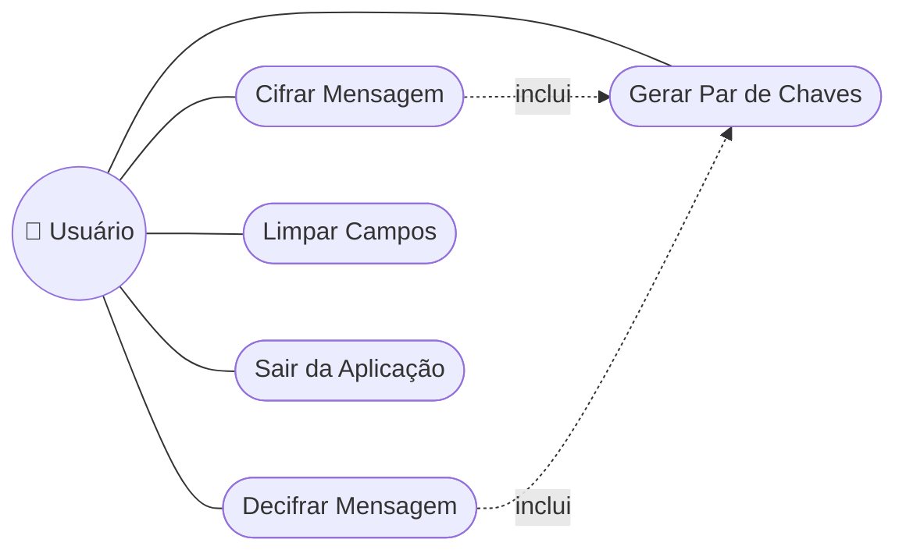
```mermaid
flowchart LR
    User((🧑 Usuário))
    UC1([Gerar Par de Chaves])
    UC2([Cifrar Mensagem])
    UC3([Decifrar Mensagem])
    UC4([Limpar Campos])
    UC5([Sair da Aplicação])

    User --- UC1
    User --- UC2
    User --- UC3
    User --- UC4
    User --- UC5
    UC2 -. inclui .-> UC1
    UC3 -. inclui .-> UC1
```
</details>

<details>
<summary><strong>5.2 Diagrama de Classes</strong></summary>

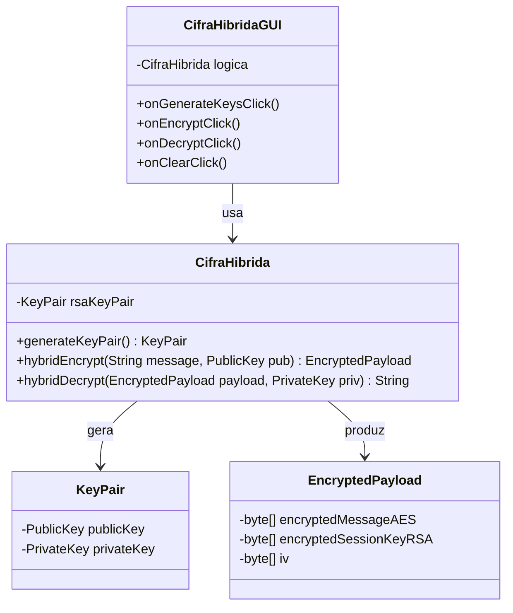
```mermaid
classDiagram
    class CifraHibridaGUI {
        -CifraHibrida logica
        +onGenerateKeysClick()
        +onEncryptClick()
        +onDecryptClick()
        +onClearClick()
    }
    class CifraHibrida {
        -KeyPair rsaKeyPair
        +generateKeyPair() KeyPair
        +hybridEncrypt(String message, PublicKey pub) EncryptedPayload
        +hybridDecrypt(EncryptedPayload payload, PrivateKey priv) String
    }
    class EncryptedPayload {
        -byte[] encryptedMessageAES
        -byte[] encryptedSessionKeyRSA
        -byte[] iv
    }
    class KeyPair {
        -PublicKey publicKey
        -PrivateKey privateKey
    }
    CifraHibridaGUI --> CifraHibrida : usa
    CifraHibrida --> KeyPair : gera
    CifraHibrida --> EncryptedPayload : produz
```
</details>

<details>
<summary><strong>5.3 Diagrama de Objetos</strong></summary>

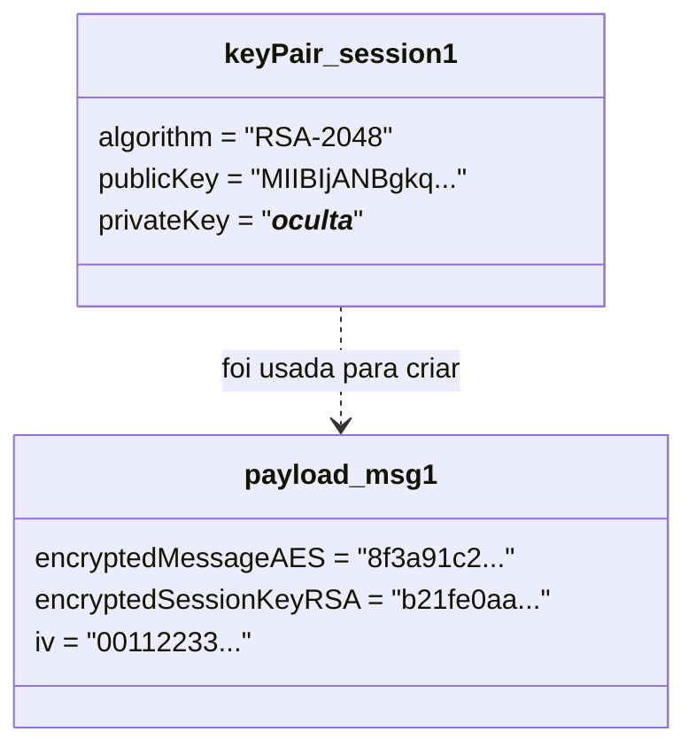
```mermaid
classDiagram
    class keyPair_session1 {
        algorithm = "RSA-2048"
        publicKey = "MIIBIjANBgkq..."
        privateKey = "***oculta***"
    }
    class payload_msg1 {
        encryptedMessageAES = "8f3a91c2..."
        encryptedSessionKeyRSA = "b21fe0aa..."
        iv = "00112233..."
    }
    keyPair_session1 ..> payload_msg1 : foi usada para criar
```
*Instantâneo de instâncias de uma única operação de cifragem em tempo de execução.*
</details>

<details>
<summary><strong>5.4 Diagrama de Sequência</strong></summary>

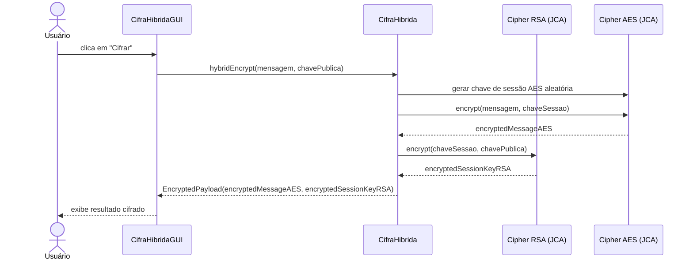
```mermaid
sequenceDiagram
    actor U as Usuário
    participant GUI as CifraHibridaGUI
    participant LOG as CifraHibrida
    participant RSA as Cipher RSA (JCA)
    participant AES as Cipher AES (JCA)

    U->>GUI: clica em "Cifrar"
    GUI->>LOG: hybridEncrypt(mensagem, chavePublica)
    LOG->>AES: gerar chave de sessão AES aleatória
    LOG->>AES: encrypt(mensagem, chaveSessao)
    AES-->>LOG: encryptedMessageAES
    LOG->>RSA: encrypt(chaveSessao, chavePublica)
    RSA-->>LOG: encryptedSessionKeyRSA
    LOG-->>GUI: EncryptedPayload(encryptedMessageAES, encryptedSessionKeyRSA)
    GUI-->>U: exibe resultado cifrado
```
</details>

<details>
<summary><strong>5.5 Diagrama de Comunicação (Colaboração)</strong></summary>

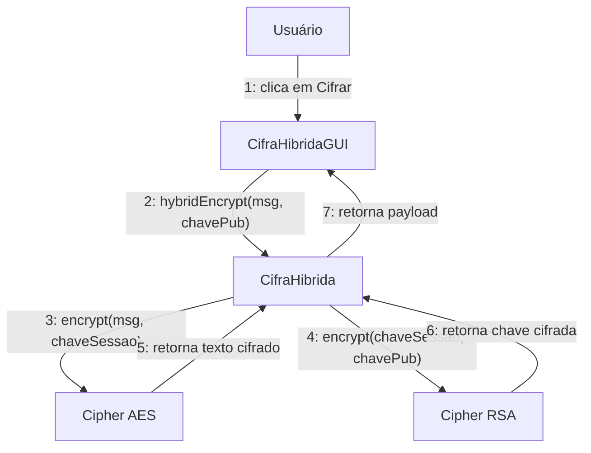
```mermaid
flowchart TD
    U[Usuário]
    GUI[CifraHibridaGUI]
    LOG[CifraHibrida]
    AES[Cipher AES]
    RSA[Cipher RSA]

    U -- "1: clica em Cifrar" --> GUI
    GUI -- "2: hybridEncrypt(msg, chavePub)" --> LOG
    LOG -- "3: encrypt(msg, chaveSessao)" --> AES
    LOG -- "4: encrypt(chaveSessao, chavePub)" --> RSA
    AES -- "5: retorna texto cifrado" --> LOG
    RSA -- "6: retorna chave cifrada" --> LOG
    LOG -- "7: retorna payload" --> GUI
```
</details>

<details>
<summary><strong>5.6 Diagrama de Atividades</strong></summary>

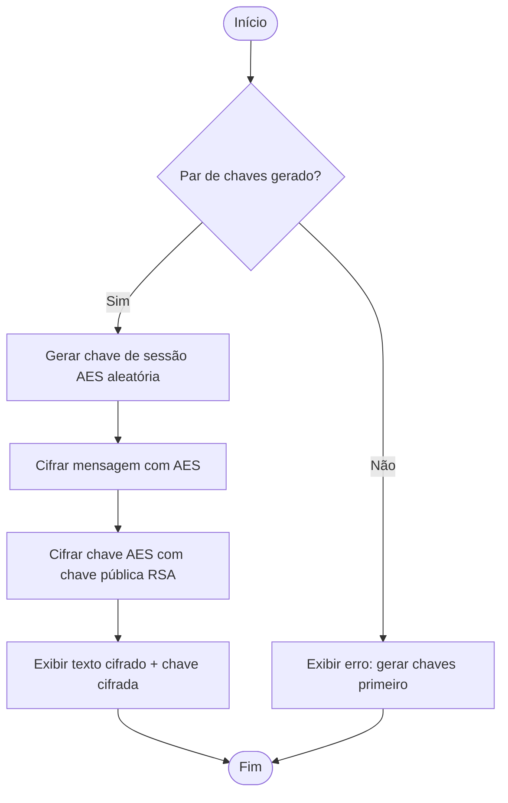
```mermaid
flowchart TD
    Start([Início]) --> A{Par de chaves gerado?}
    A -- Não --> Err1[Exibir erro: gerar chaves primeiro]
    A -- Sim --> B[Gerar chave de sessão AES aleatória]
    B --> C[Cifrar mensagem com AES]
    C --> D[Cifrar chave AES com chave pública RSA]
    D --> E[Exibir texto cifrado + chave cifrada]
    E --> Fim([Fim])
    Err1 --> Fim
```
</details>

<details>
<summary><strong>5.7 Diagrama de Máquina de Estados</strong></summary>

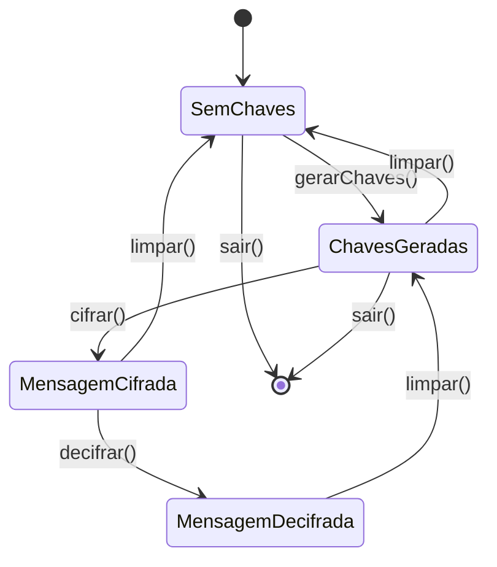
```mermaid
stateDiagram-v2
    [*] --> SemChaves
    SemChaves --> ChavesGeradas : gerarChaves()
    ChavesGeradas --> MensagemCifrada : cifrar()
    MensagemCifrada --> MensagemDecifrada : decifrar()
    MensagemDecifrada --> ChavesGeradas : limpar()
    ChavesGeradas --> SemChaves : limpar()
    MensagemCifrada --> SemChaves : limpar()
    SemChaves --> [*] : sair()
    ChavesGeradas --> [*] : sair()
```
</details>

<details>
<summary><strong>5.8 Diagrama de Componentes</strong></summary>

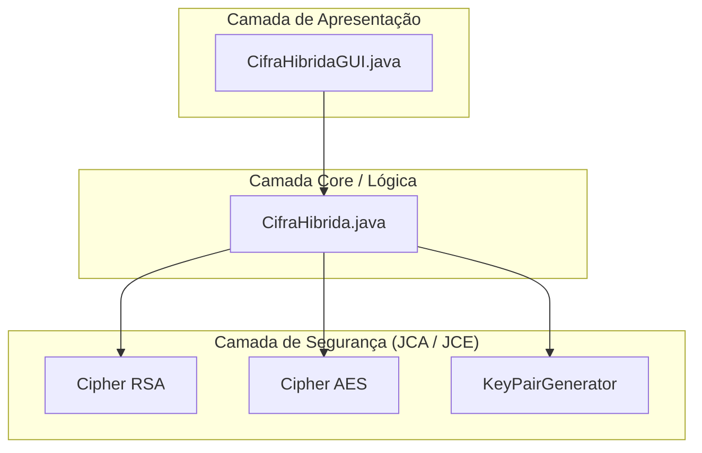
```mermaid
flowchart TB
    subgraph Apresentacao["Camada de Apresentação"]
        GUI[CifraHibridaGUI.java]
    end
    subgraph Nucleo["Camada Core / Lógica"]
        LOG[CifraHibrida.java]
    end
    subgraph Seguranca["Camada de Segurança (JCA / JCE)"]
        RSA[Cipher RSA]
        AES[Cipher AES]
        KG[KeyPairGenerator]
    end

    GUI --> LOG
    LOG --> RSA
    LOG --> AES
    LOG --> KG
```
</details>

<details>
<summary><strong>5.9 Diagrama de Implantação (Deployment)</strong></summary>

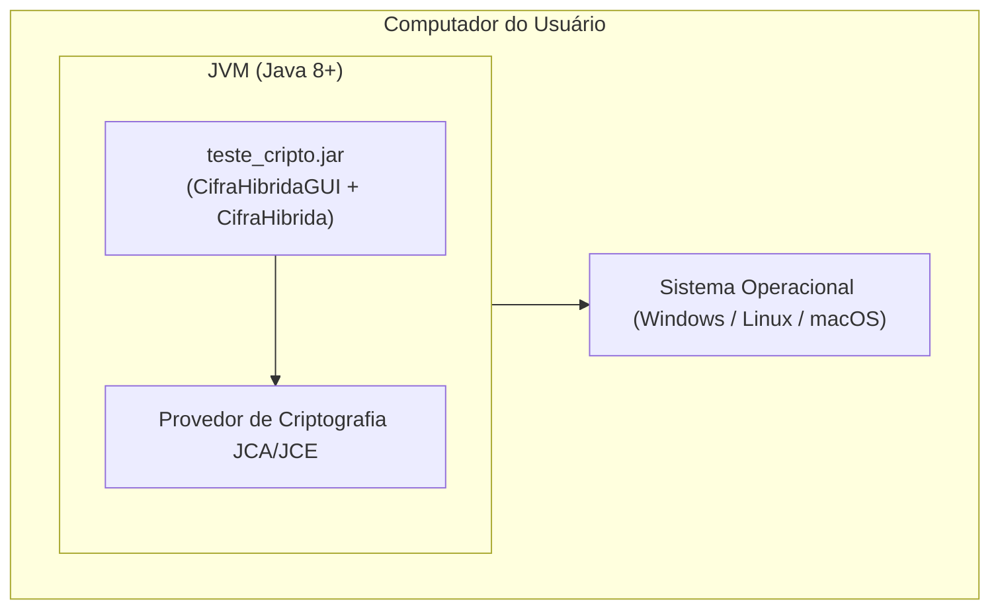
```mermaid
flowchart TB
    subgraph Maquina["Computador do Usuário"]
        subgraph JVM["JVM (Java 8+)"]
            JAR["teste_cripto.jar\n(CifraHibridaGUI + CifraHibrida)"]
            JCA["Provedor de Criptografia JCA/JCE"]
        end
        OS["Sistema Operacional (Windows / Linux / macOS)"]
    end

    JAR --> JCA
    JVM --> OS
```
</details>

<details>
<summary><strong>5.10 Diagrama de Pacotes</strong></summary>

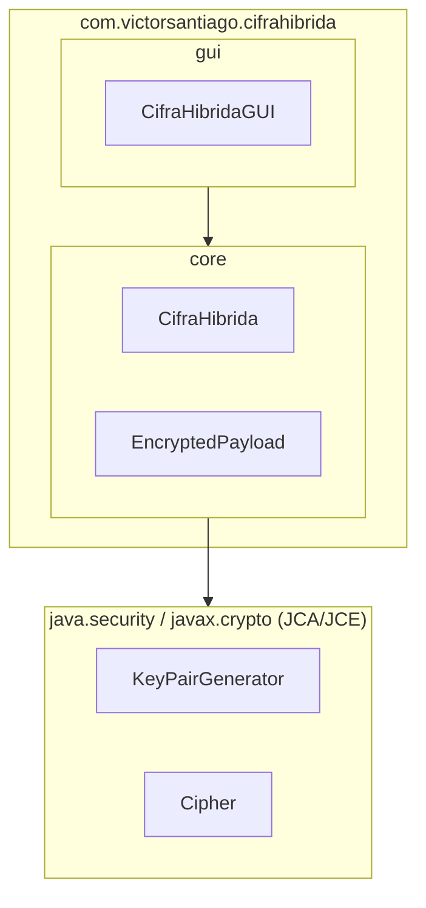
```mermaid
flowchart TB
    subgraph app["com.victorsantiago.cifrahibrida"]
        subgraph gui["gui"]
            G1[CifraHibridaGUI]
        end
        subgraph core["core"]
            C1[CifraHibrida]
            C2[EncryptedPayload]
        end
    end
    subgraph jca["java.security / javax.crypto (JCA/JCE)"]
        K1[KeyPairGenerator]
        K2[Cipher]
    end

    gui --> core
    core --> jca
```
</details>

<details>
<summary><strong>5.11 Diagrama de Estrutura Composta</strong></summary>

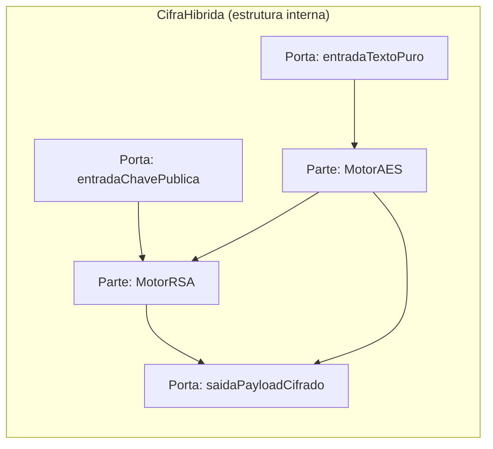
```mermaid
flowchart TB
    subgraph CifraHibrida["CifraHibrida (estrutura interna)"]
        direction TB
        P1["Porta: entradaTextoPuro"]
        P2["Porta: entradaChavePublica"]
        P3["Parte: MotorAES"]
        P4["Parte: MotorRSA"]
        P5["Porta: saidaPayloadCifrado"]

        P1 --> P3
        P2 --> P4
        P3 --> P4
        P4 --> P5
        P3 --> P5
    end
```
</details>

<details>
<summary><strong>5.12 Diagrama de Visão Geral de Interação</strong></summary>

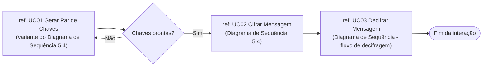
```mermaid
flowchart LR
    A["ref: UC01 Gerar Par de Chaves\n(variante do Diagrama de Sequência 5.4)"] --> B{Chaves prontas?}
    B -- Sim --> C["ref: UC02 Cifrar Mensagem\n(Diagrama de Sequência 5.4)"]
    B -- Não --> A
    C --> D["ref: UC03 Decifrar Mensagem\n(Diagrama de Sequência - fluxo de decifragem)"]
    D --> E([Fim da interação])
```
</details>

<details>
<summary><strong>5.13 Diagrama de Tempo (Timing)</strong></summary>

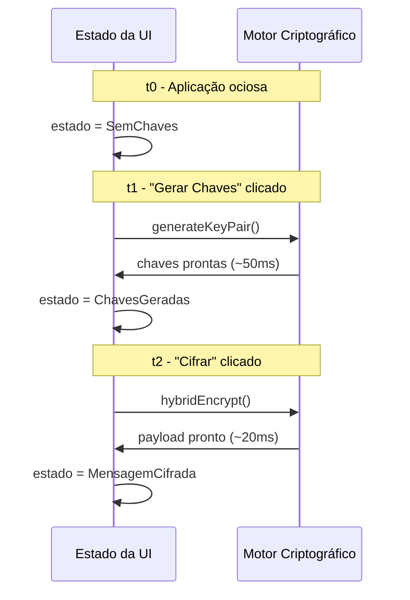
```mermaid
sequenceDiagram
    participant UI as Estado da UI
    participant CR as Motor Criptográfico

    Note over UI,CR: t0 - Aplicação ociosa
    UI->>UI: estado = SemChaves
    Note over UI,CR: t1 - "Gerar Chaves" clicado
    UI->>CR: generateKeyPair()
    CR->>UI: chaves prontas (~50ms)
    UI->>UI: estado = ChavesGeradas
    Note over UI,CR: t2 - "Cifrar" clicado
    UI->>CR: hybridEncrypt()
    CR->>UI: payload pronto (~20ms)
    UI->>UI: estado = MensagemCifrada
```
</details>

---

## 6. Modelo de Dados & Dicionário de Dados 🗄️

<details>
<summary><strong>Clique para expandir — DER, Modelos Conceitual/Lógico/Físico e Dicionário de Dados</strong></summary>

### 6.1 Diagrama Entidade-Relacionamento (DER)

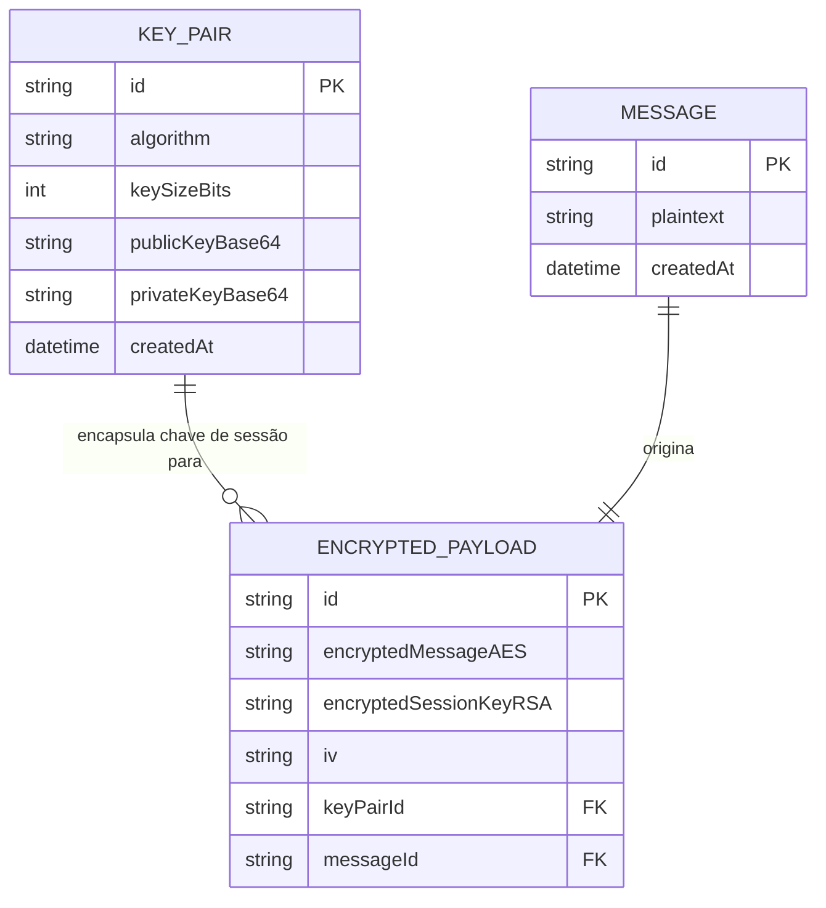
```mermaid
erDiagram
    KEY_PAIR {
        string id PK
        string algorithm
        int keySizeBits
        string publicKeyBase64
        string privateKeyBase64
        datetime createdAt
    }
    MESSAGE {
        string id PK
        string plaintext
        datetime createdAt
    }
    ENCRYPTED_PAYLOAD {
        string id PK
        string encryptedMessageAES
        string encryptedSessionKeyRSA
        string iv
        string keyPairId FK
        string messageId FK
    }

    KEY_PAIR ||--o{ ENCRYPTED_PAYLOAD : "encapsula chave de sessão para"
    MESSAGE  ||--|| ENCRYPTED_PAYLOAD : "origina"
```

### 6.2 Modelo Conceitual de Dados
Uma visão simplificada e independente de tecnologia: um **Usuário** gera um **Par de Chaves**, escreve uma **Mensagem** e produz um **Payload Cifrado** que reúne o texto cifrado AES com a chave AES encapsulada via RSA.

### 6.3 Modelo Lógico de Dados
| Entidade | Atributo | Tipo | Observações |
|:---|:---|:---|:---|
| KeyPair | id | UUID | Gerado por sessão |
| KeyPair | algorithm | String | "RSA" |
| KeyPair | keySizeBits | Integer | 2048 (RNF01) |
| KeyPair | publicKeyBase64 | String | Exibida ao usuário |
| KeyPair | privateKeyBase64 | String | Exibida ao usuário (somente local) |
| Message | plaintext | String (UTF-8) | Entrada do usuário |
| EncryptedPayload | encryptedMessageAES | byte[] / Base64 | Texto cifrado AES-256 |
| EncryptedPayload | encryptedSessionKeyRSA | byte[] / Base64 | Chave AES encapsulada via RSA |
| EncryptedPayload | iv | byte[] / Base64 | Vetor de inicialização (se modo CBC) |

### 6.4 Modelo Físico de Dados
A versão atual é **somente em memória** (RNF05/RDA04) — nenhuma tabela é persistida. Caso a persistência seja adicionada, o modelo acima mapeia diretamente para tabelas relacionais (`key_pair`, `message`, `encrypted_payload`) com colunas `VARCHAR`/`BLOB` correspondentes ao Modelo Lógico de Dados.

### 6.5 Dicionário de Dados

| Campo | Tipo | Descrição | Restrições |
|:---|:---|:---|:---|
| `publicKey` | `java.security.PublicKey` | Chave pública RSA, compartilhável | Algoritmo = RSA, tamanho = 2048 bits |
| `privateKey` | `java.security.PrivateKey` | Chave privada RSA, secreta | Nunca transmitida (RN05) |
| `sessionKey` | `javax.crypto.SecretKey` | Chave AES, gerada por mensagem | Algoritmo = AES, tamanho = 256 bits, uso único (RN02) |
| `plaintext` | `String` | Mensagem original do usuário | Codificada em UTF-8 |
| `encryptedMessageAES` | `byte[]` | Texto cifrado de `plaintext` | Saída do cipher AES |
| `encryptedSessionKeyRSA` | `byte[]` | `sessionKey` cifrada com `publicKey` | Saída do cipher RSA |

</details>

---

## 7. Diagrama de Fluxo de Dados (DFD) & Linhagem de Dados 🔄

<details>
<summary><strong>Clique para expandir — DFD Nível 0/1 e Linhagem de Dados</strong></summary>

### 7.1 Diagrama de Fluxo de Dados (Nível 0/1)

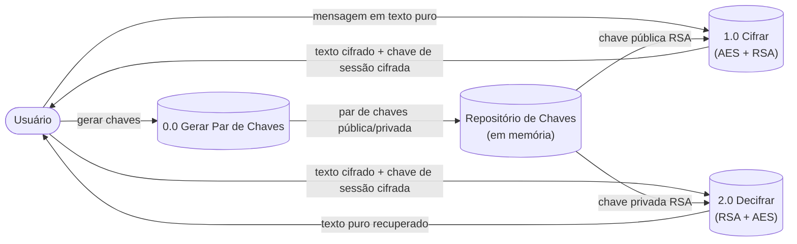
```mermaid
flowchart LR
    U([Usuário]) -->|mensagem em texto puro| P1[("1.0 Cifrar\n(AES + RSA)")]
    KS[("Repositório de Chaves\n(em memória)")] -->|chave pública RSA| P1
    P1 -->|texto cifrado + chave de sessão cifrada| U

    U -->|texto cifrado + chave de sessão cifrada| P2[("2.0 Decifrar\n(RSA + AES)")]
    KS -->|chave privada RSA| P2
    P2 -->|texto puro recuperado| U

    U -->|"gerar chaves"| P0[("0.0 Gerar Par de Chaves")]
    P0 -->|par de chaves pública/privada| KS
```

### 7.2 Diagrama de Linhagem de Dados

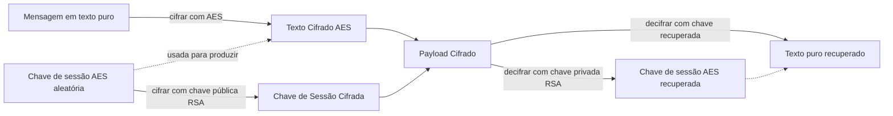
```mermaid
flowchart LR
    A[Mensagem em texto puro] -->|cifrar com AES| B[Texto Cifrado AES]
    C[Chave de sessão AES aleatória] -->|cifrar com chave pública RSA| D[Chave de Sessão Cifrada]
    C -.->|usada para produzir| B
    B --> E[Payload Cifrado]
    D --> E
    E -->|decifrar com chave privada RSA| C2[Chave de sessão AES recuperada]
    E -->|decifrar com chave recuperada| A2[Texto puro recuperado]
    C2 -.-> A2
```

</details>

---

## 8. Diagrama de Arquitetura & Fluxograma 🏛️

<details>
<summary><strong>Clique para expandir — Visão Geral da Arquitetura e Fluxograma Principal</strong></summary>

### 8.1 Diagrama de Arquitetura

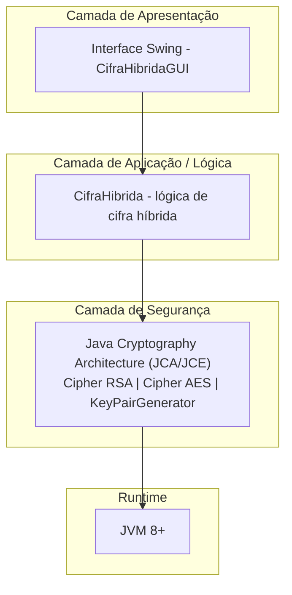
```mermaid
flowchart TB
    subgraph L1["Camada de Apresentação"]
        UI[Interface Swing - CifraHibridaGUI]
    end
    subgraph L2["Camada de Aplicação / Lógica"]
        LOGIC[CifraHibrida - lógica de cifra híbrida]
    end
    subgraph L3["Camada de Segurança"]
        JCA["Java Cryptography Architecture (JCA/JCE)\nCipher RSA | Cipher AES | KeyPairGenerator"]
    end
    subgraph L4["Runtime"]
        JVM["JVM 8+"]
    end

    UI --> LOGIC --> JCA --> JVM
```

### 8.2 Fluxograma Principal (Ciclo de Cifrar / Decifrar)

```mermaid
flowchart TD
    Start([Abrir Aplicação]) --> Gen[Clicar em "Gerar Chaves"]
    Gen --> Type[Digitar mensagem]
    Type --> Enc[Clicar em "Cifrar"]
    Enc --> Out1[Visualizar texto cifrado AES + chave cifrada RSA]
    Out1 --> Share{Compartilhar com destinatário?}
    Share -- Sim --> Dec[Clicar em "Decifrar" com chave privada]
    Share -- Não --> Clear[Clicar em "Limpar"]
    Dec --> Out2[Visualizar mensagem original recuperada]
    Out2 --> Clear
    Clear --> Decide{Continuar?}
    Decide -- Sim --> Type
    Decide -- Não --> Exit([Clicar em "Sair"])
```

</details>

---

## 9. Persona & Mapa de Jornada do Usuário 👤

<details>
<summary><strong>Clique para expandir — Persona e Mapa de Jornada do Usuário</strong></summary>

### 9.1 Persona

| | |
|:---|:---|
| **Nome** | Ana Souza |
| **Papel** | Estudante de Ciência da Computação / desenvolvedora backend júnior |
| **Objetivo** | Entender, na prática, como funciona a cifra híbrida (RSA + AES) antes de aplicá-la em um projeto real. |
| **Nível Técnico** | Confortável com Java, iniciante em criptografia aplicada (JCA/JCE). |
| **Frustrações** | A teoria de criptografia parece abstrata; quer uma ferramenta visual, clique a clique, para ver chaves e textos cifrados. |
| **Motivação** | Precisa cumprir uma atividade da disciplina de Segurança e construir um projeto de portfólio. |

### 9.2 Mapa de Jornada do Usuário

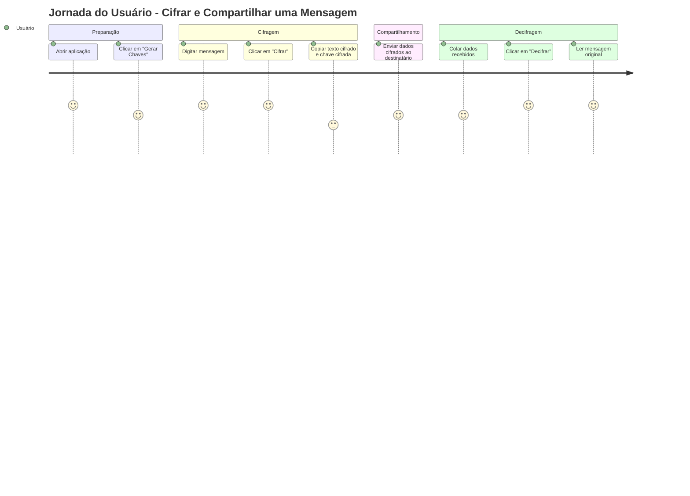
```mermaid
journey
    title Jornada do Usuário - Cifrar e Compartilhar uma Mensagem
    section Preparação
      Abrir aplicação: 5: Usuário
      Clicar em "Gerar Chaves": 4: Usuário
    section Cifragem
      Digitar mensagem: 5: Usuário
      Clicar em "Cifrar": 5: Usuário
      Copiar texto cifrado e chave cifrada: 3: Usuário
    section Compartilhamento
      Enviar dados cifrados ao destinatário: 4: Usuário
    section Decifragem
      Colar dados recebidos: 4: Usuário
      Clicar em "Decifrar": 5: Usuário
      Ler mensagem original: 5: Usuário
```

</details>

---

## 10. Wireframes & Mockups 🖼️

<details>
<summary><strong>Clique para expandir — Wireframe da Interface</strong></summary>

```
┌──────────────────────────────────────────────────────────────┐
│  🔒 Programa de Cifra Híbrida — RSA + AES                      │
├──────────────────────────────────────────────────────────────┤
│  Chave Pública:  [ área de texto somente leitura, Base64    ]  │
│  Chave Privada:  [ área de texto somente leitura, Base64    ]  │
│                                       [ 🗝️ Gerar Chaves ]      │
├──────────────────────────────────────────────────────────────┤
│  Mensagem:       [ área de texto multilinha de entrada      ]  │
│                                       [ 🔒 Cifrar ]            │
│  Cifrado (AES):       [ área de texto somente leitura, Base64 ]│
│  Chave Cifrada (RSA): [ área de texto somente leitura, Base64 ]│
├──────────────────────────────────────────────────────────────┤
│                                       [ 🔓 Decifrar ]          │
│  Mensagem Decifrada:  [ área de texto somente leitura        ]│
├──────────────────────────────────────────────────────────────┤
│              [ 🧹 Limpar ]                 [ 🚪 Sair ]         │
└──────────────────────────────────────────────────────────────┘
```

*O mockup reflete o layout real em Swing de `CifraHibridaGUI`: áreas de texto para chaves, mensagem e resultados, além dos botões de ação (Gerar Chaves, Cifrar, Decifrar, Limpar, Sair).*

</details>

---

## 🚀 Instalação & Execução

### Pré-requisitos
- **Java JDK 8+**
- **Apache NetBeans** *(opcional, necessário apenas para compilar pela IDE)*
- **Git**

### Opção 1 — Executar o JAR pré-compilado (recomendado)

```bash
git clone https://github.com/VictorHJesusSantiago/programa_criptografico_chaves.git
cd programa_criptografico_chaves/teste_cripto/dist
java -jar teste_cripto.jar
```

### Opção 2 — Compilar e executar via NetBeans

```
1. Abra o Apache NetBeans IDE
2. File → Open Project...
3. Selecione a pasta 'teste_cripto'
4. Clique em "Run Project" (F6)
```

### Como Usar

| Passo | Ação |
|:-:|:---|
| 1️⃣ | Clique em **Gerar Chaves** para criar o par de chaves RSA. |
| 2️⃣ | Digite a mensagem que deseja proteger. |
| 3️⃣ | Clique em **Cifrar** — o texto cifrado AES e a chave de sessão cifrada via RSA são exibidos. |
| 4️⃣ | Clique em **Decifrar** para recuperar a mensagem original usando a chave privada. |
| 5️⃣ | Use **Limpar** para resetar todos os campos, ou **Sair** para fechar a aplicação. |

---

## 👨‍💻 Autor

<div align="center">

**Victor Henrique de Jesus Santiago**
Full Stack Developer

[](mailto:victorhenriquedejesussantiago@gmail.com)
[](https://www.linkedin.com/in/victor-henrique-de-jesus-santiago/)
[](https://github.com/VictorHJesusSantiago)

</div>

---

<div align="center">

*Feito com 🔒 e Java por **Victor H. J. Santiago***

</div>
